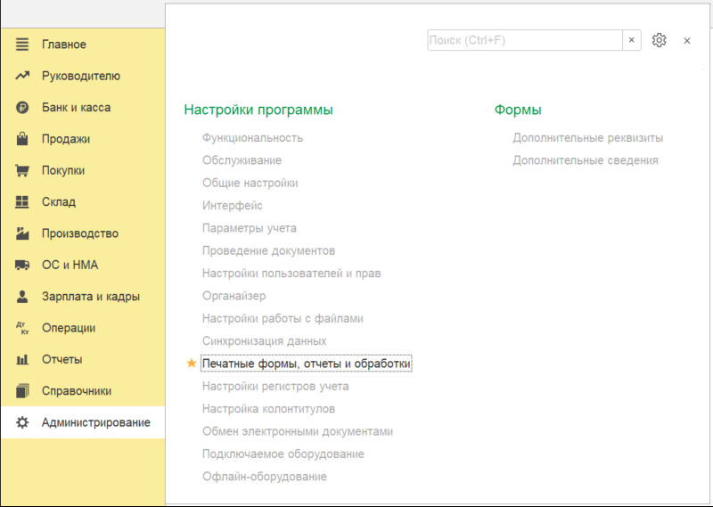
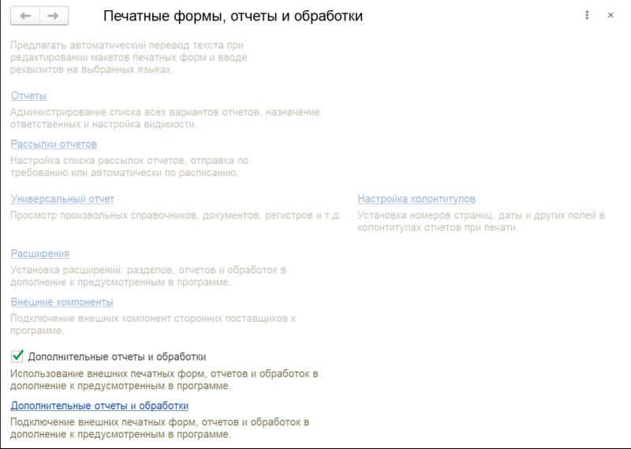
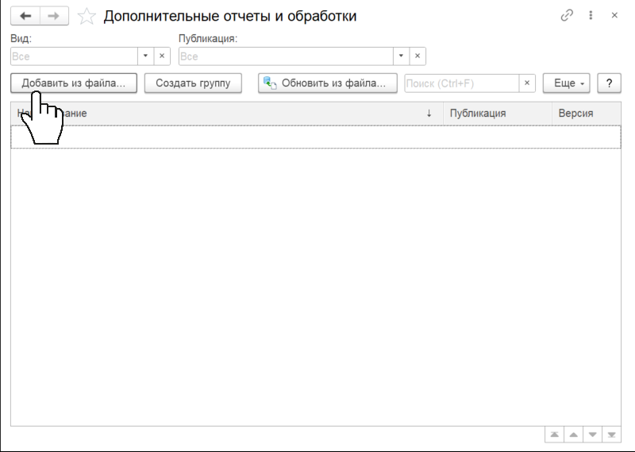
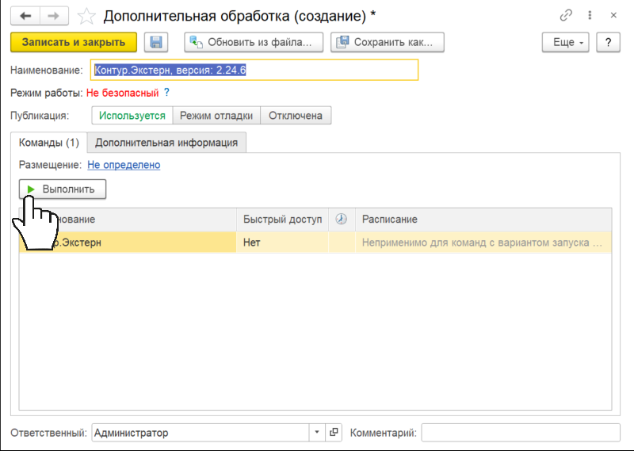

# Как запустить модуль

Скачивание начнется автоматическии, если этого не произошло, <a id="raw-url" href="https://update.kontur.ru/1c/v1/kext/data-processor">скачайте модуль вручную</a>

---

1. Откройте раздел **Администрирование** и выберите **Печатные формы, отчеты и обработки**

    !!! info "Если раздел недоступен, попросите установить модуль администратора или коллегу с полными правами"

    
      

2. Отметьте галочкой **Дополнительные отчеты и обработки** и откройте их список

     
      

3. В открывшемся окне нажмите кнопку **Добавить из файла** и выберите файл KonturExtern.epf

     
      

4. Нажмите **Выполнить** чтобы запустить модуль

     
      
