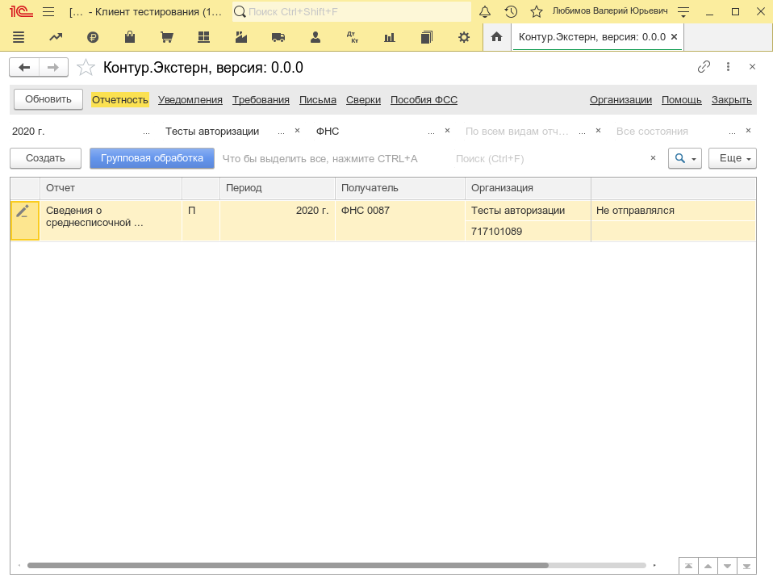
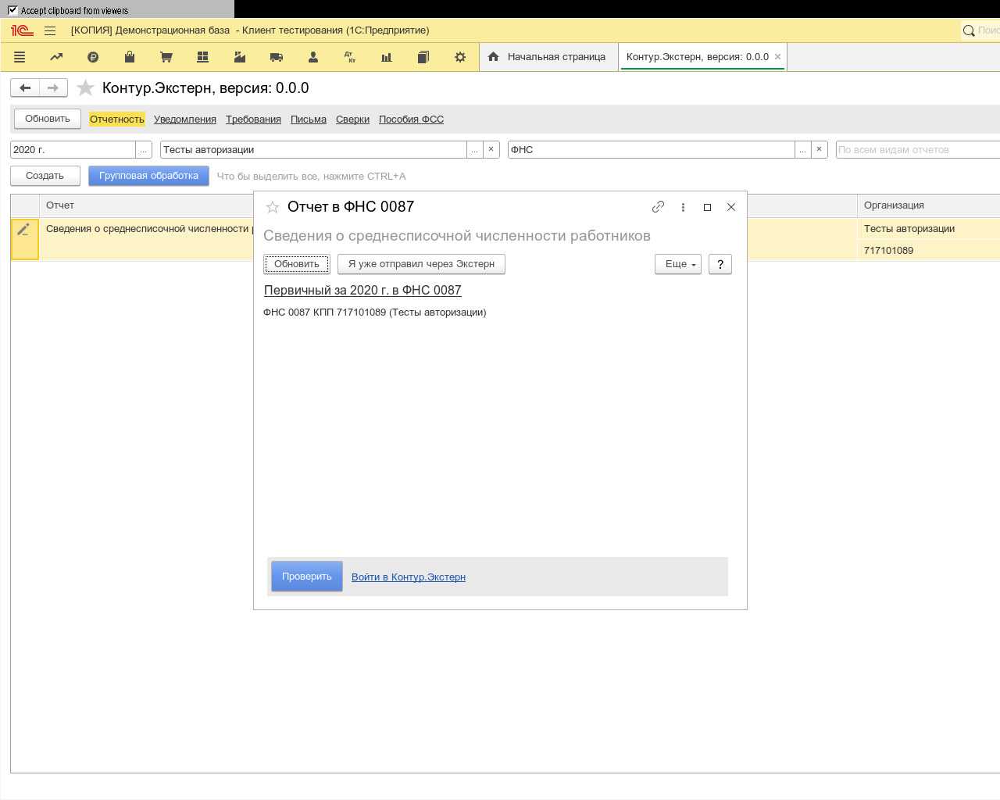
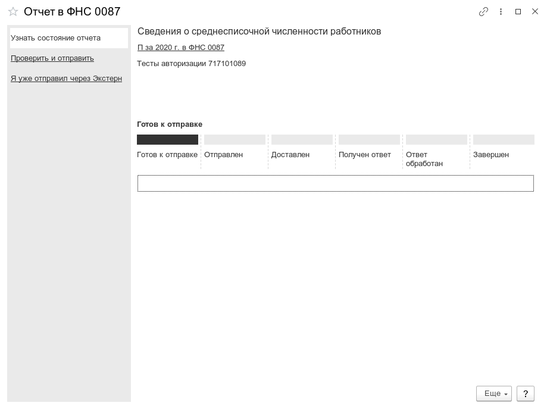
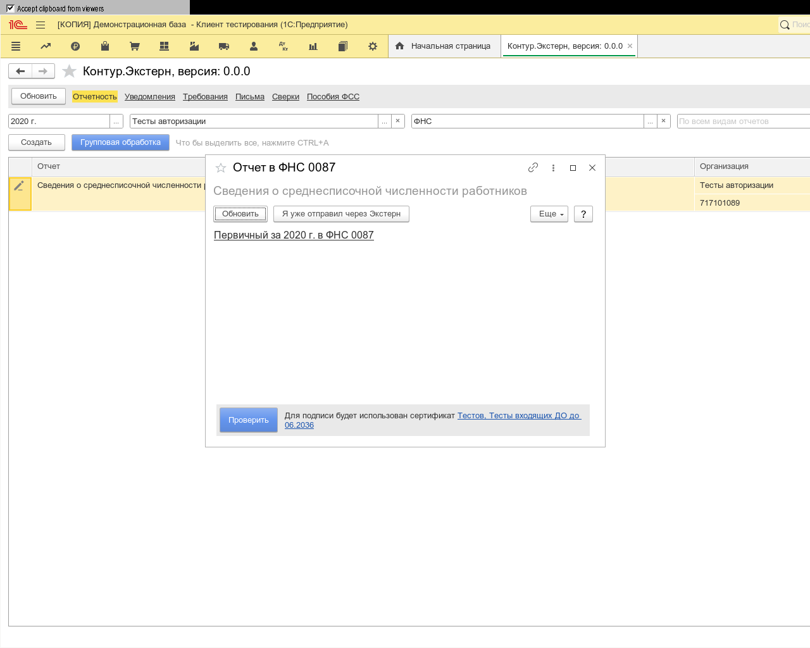

**Функционал:** Авторизация

**Сценарий:** Авторизация

	001. При отправке отчета

	002. Если вы ранее не авторизовались в сервисе, нажмите "Войти в Контур.Экстерн"

	003. И в таблице "СписокСертификатов" я перехожу к строке по шаблону:

	004. Вы авторизованы и готовы отправлять отчет

