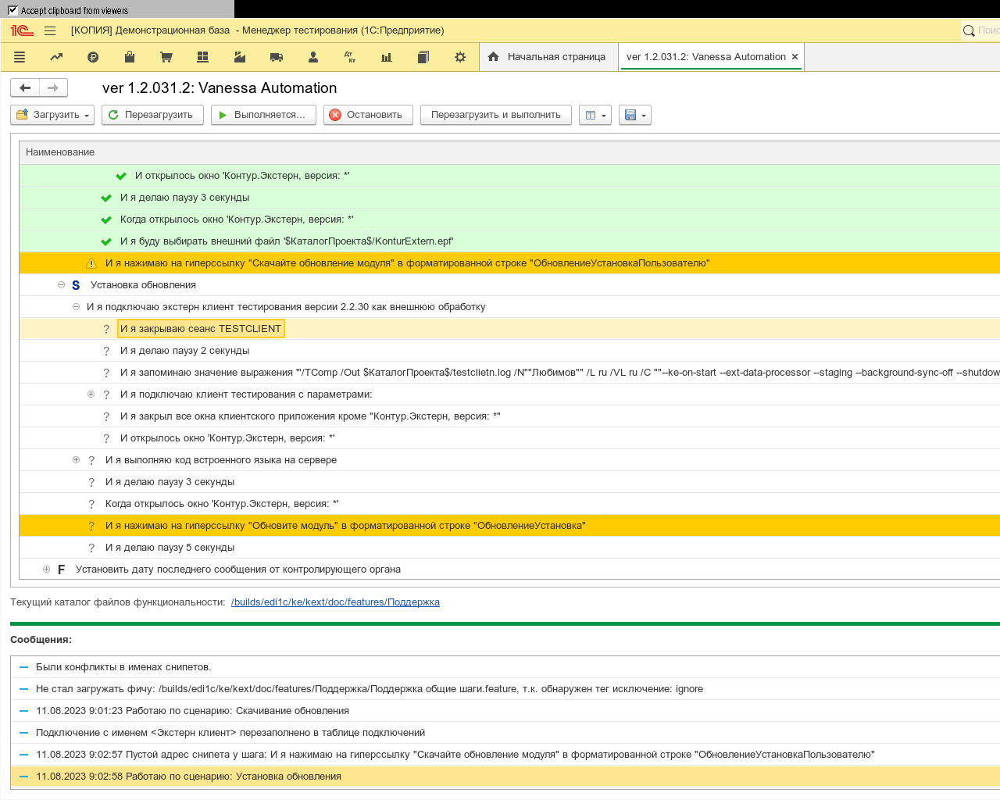
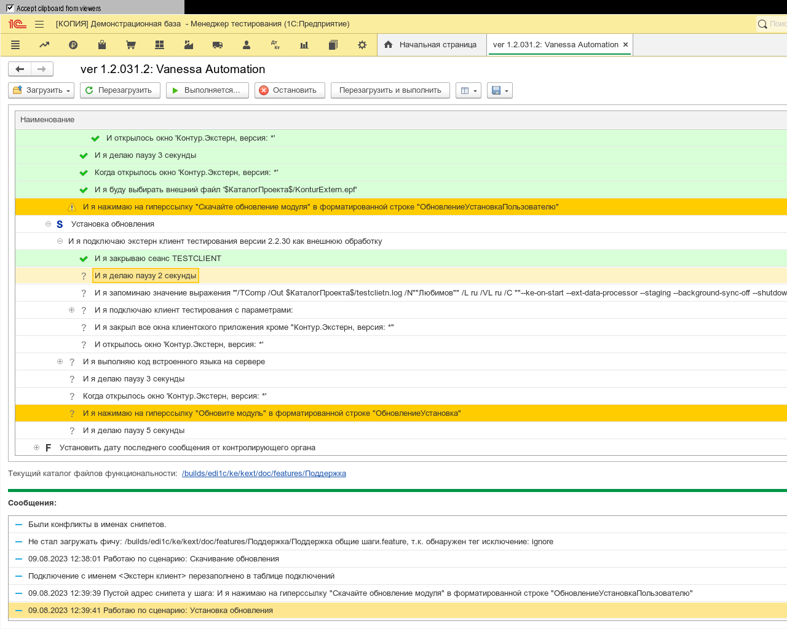
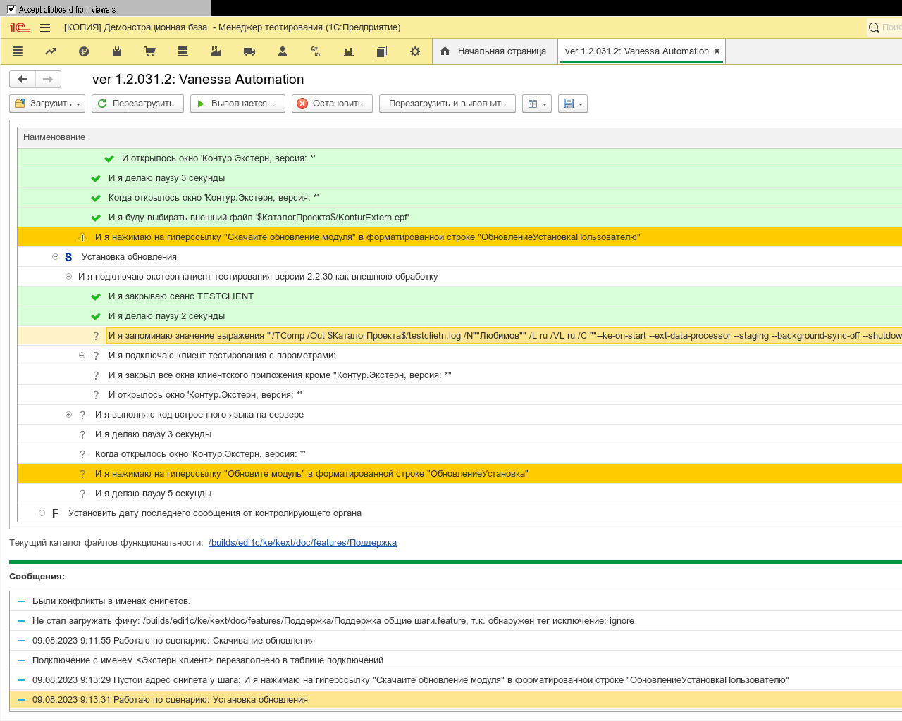
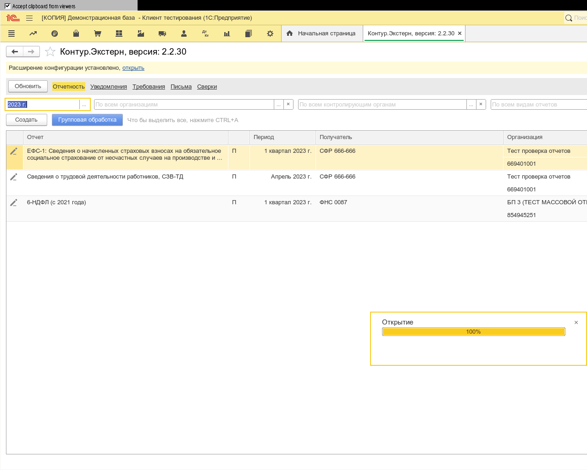
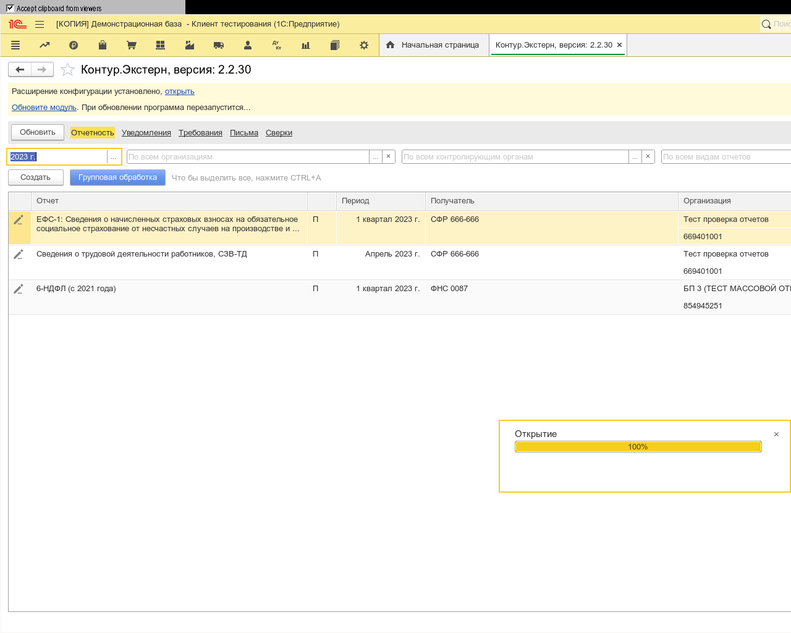

**Функционал:** Обновления

**Сценарий:** Скачивание обновления

**Сценарий:** Установка обновления

	001. И я закрываю сеанс TESTCLIENT

	002. И я делаю паузу 2 секунды

	003. И я запоминаю значение выражения '"/TComp /Out $КаталогПроекта$/testclietn.log /N""Любимов"" /L ru /VL ru /C ""--ke-on-start --ext-data-processor --staging --background-sync-off --shutdown --version 2.2.30 --verbose 7 --disable-installer --output $КаталогПроекта$/test.log"""' в переменную "ДопПараметры"

	004. И я подключаю клиент тестирования с параметрами:

	005. И я закрыл все окна клиентского приложения кроме "Контур.Экстерн, версия: *"

	006. И открылось окно 'Контур.Экстерн, версия: *'

