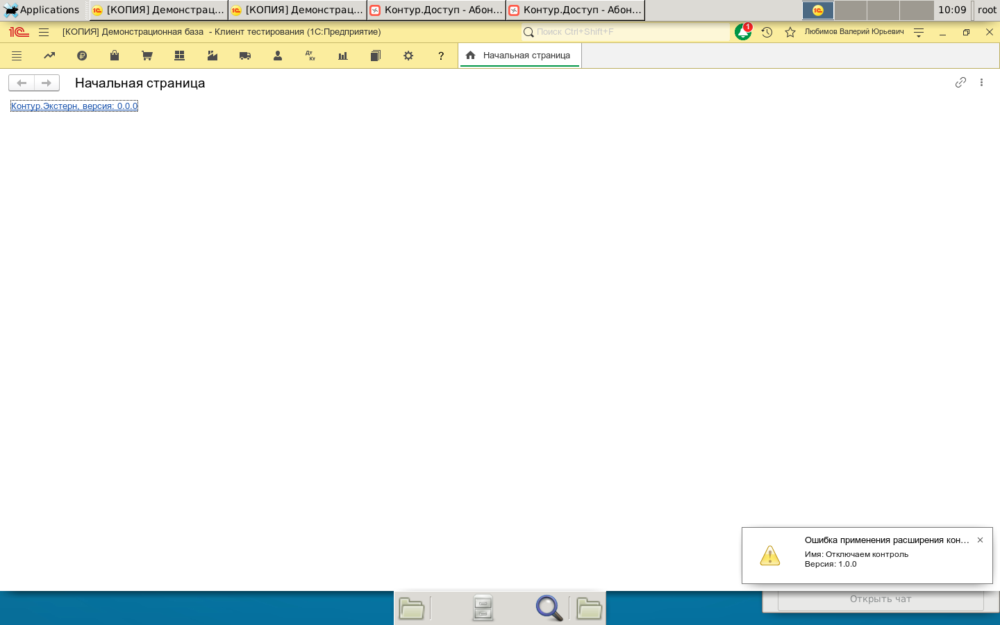
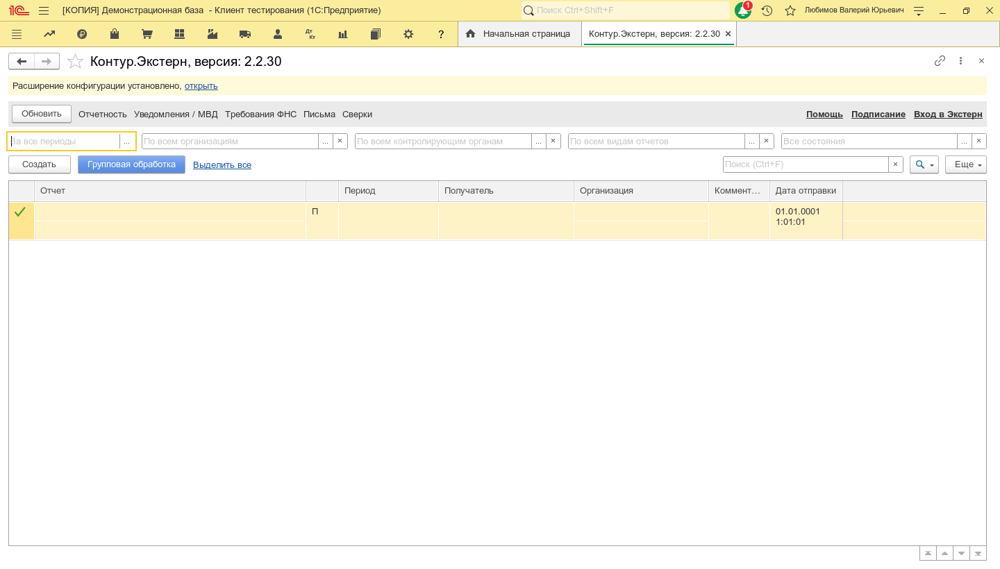
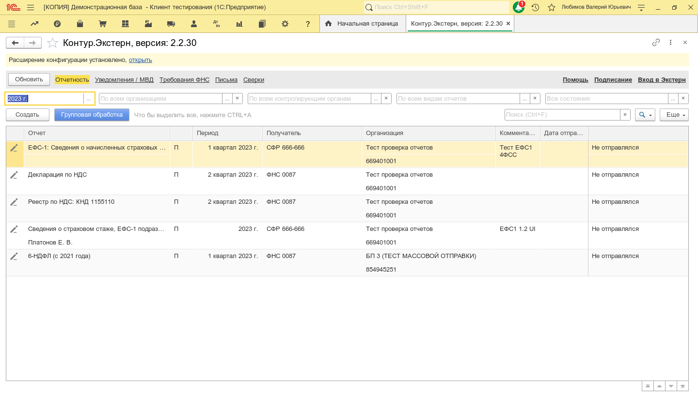
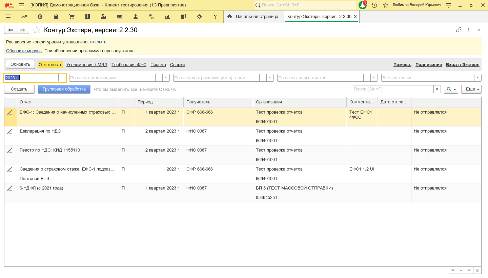

001. Нажмите "Скачайте обновление модуля", для скачивания файла обработки (.epf) на диск

001. И я закрываю сеанс TESTCLIENT

002. И я делаю паузу 2 секунды

003. И я запоминаю значение выражения '"/TComp /Out $КаталогПроекта$/testclietn.log /N""Любимов"" /L ru /VL ru /C ""--ke-on-start --ext-data-processor --staging --background-sync-off --shutdown --version 2.2.30 --verbose 7 --disable-installer --output $КаталогПроекта$/test.log"""' в переменную "ДопПараметры"

004. И я подключаю клиент тестирования с параметрами:

005. И я закрыл все окна клиентского приложения кроме "Контур.Экстерн, версия: *"

006. И открылось окно 'Контур.Экстерн, версия: *'

007. Для установки обновления в справочник доп. обработки нажмите "Обновите модуль"

