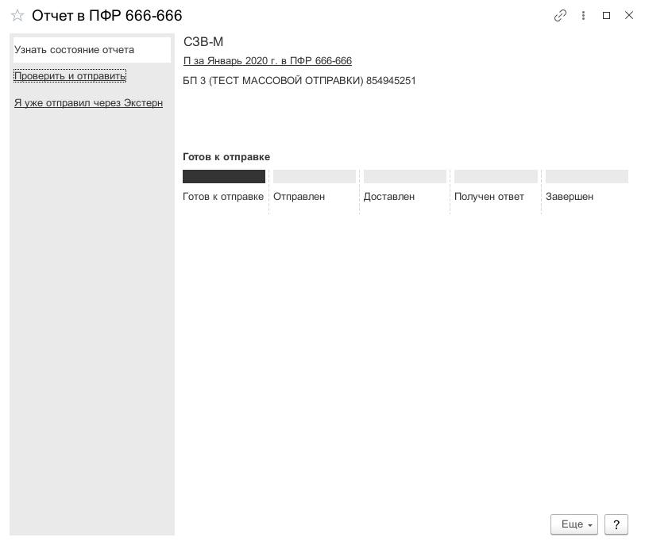
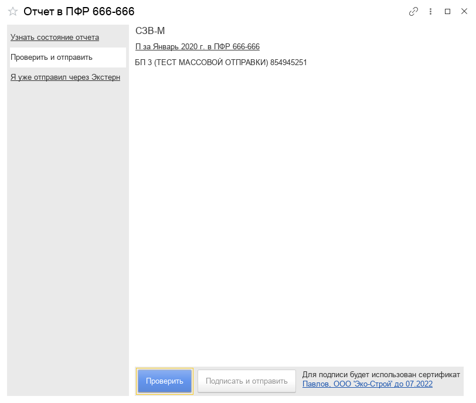
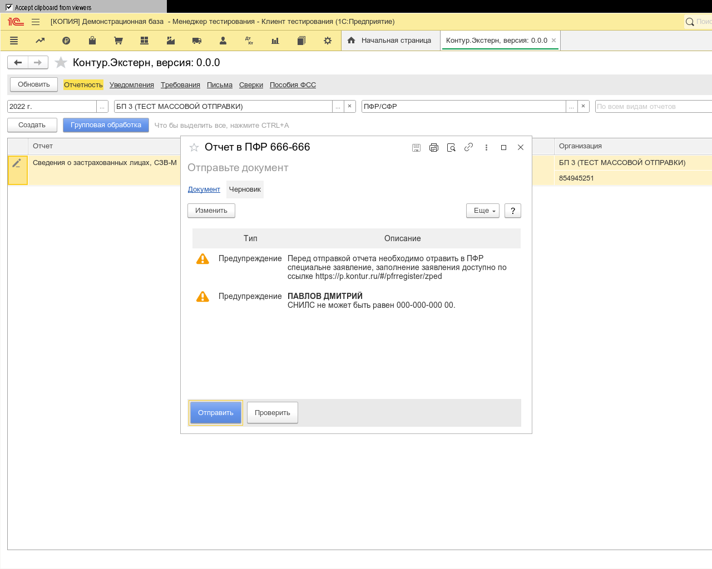

**Функционал:** Отправка в ПФР

**Сценарий:** ПФР

	001. Двойным кликом откроем отчет СЗВ-М

	002. В форме отчета нажмите "Проверить"

	003. Ожидайте проверки

	004. Подписать и отправить, после проверки

	005. Ваш отчет был отправлен

