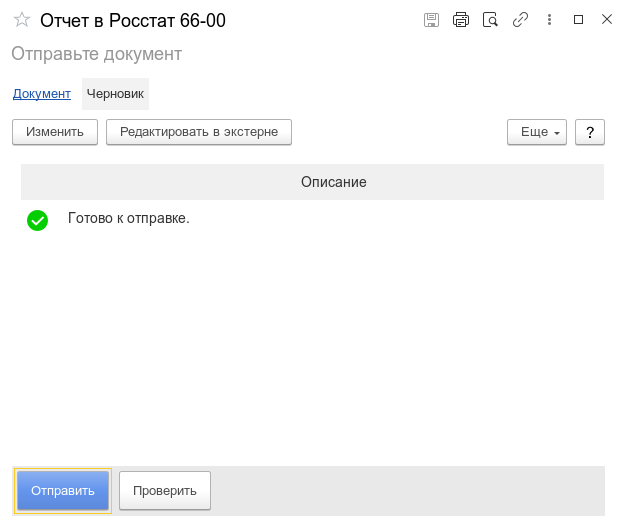
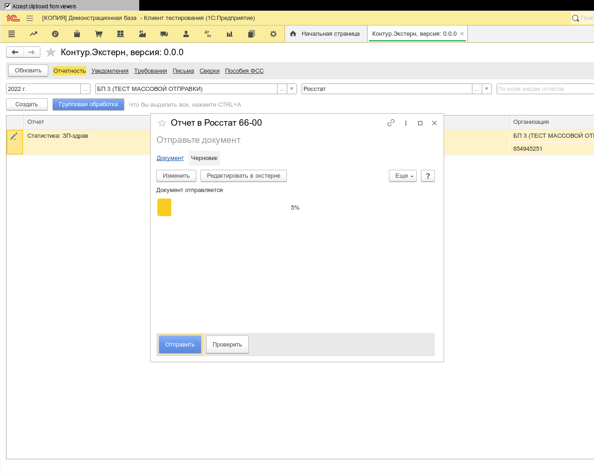

**Функционал:** Отправка в Росстат

**Сценарий:** Росстат

	001. Двойным кликом откроем отчет ЗП-здрав

	002. затем "Проверить"

	003. Ожидайте проверки

	004. Отправить, после проверки

	005. Ваш отчет был отправлен

