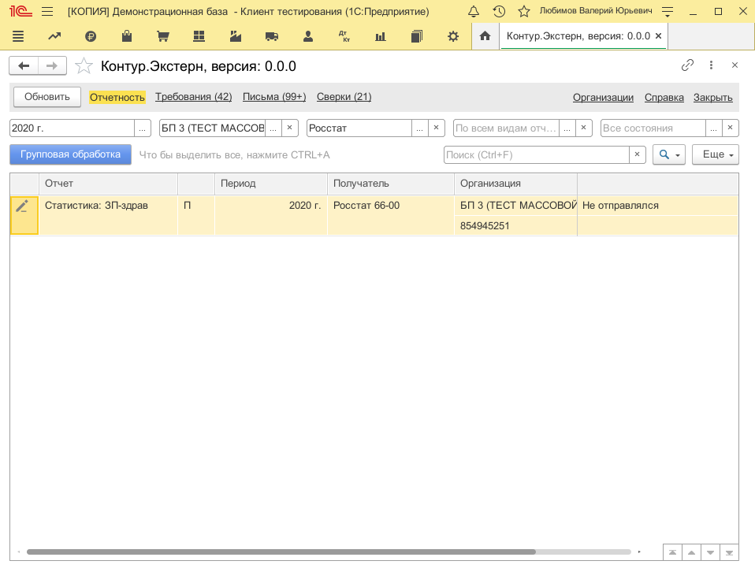
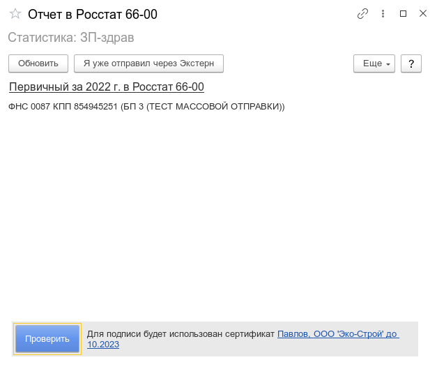
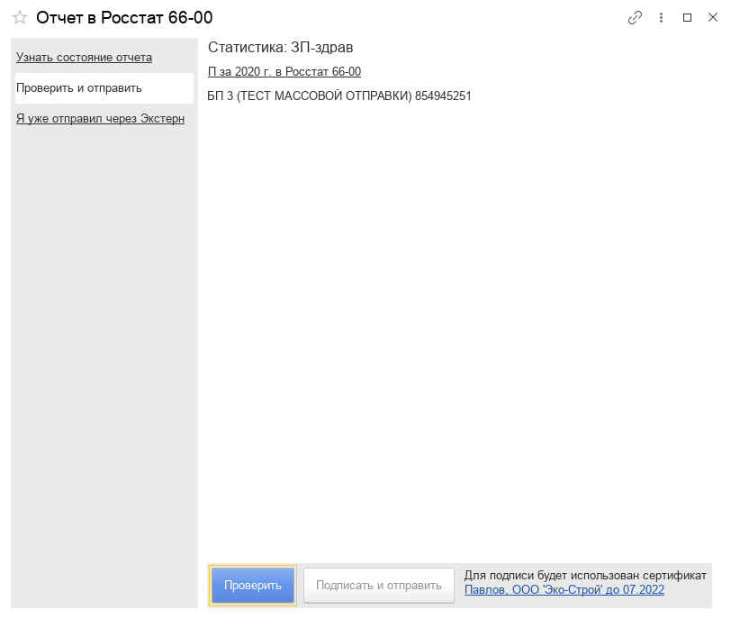
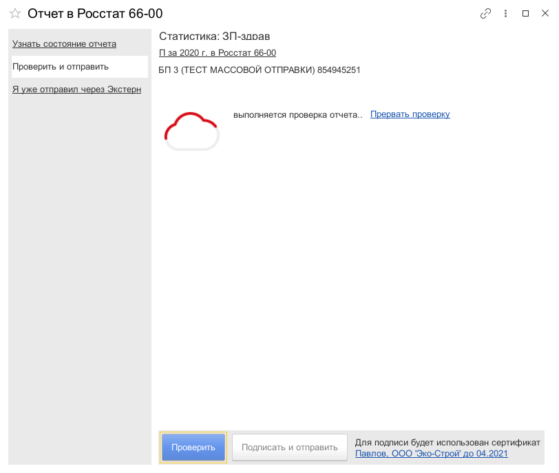
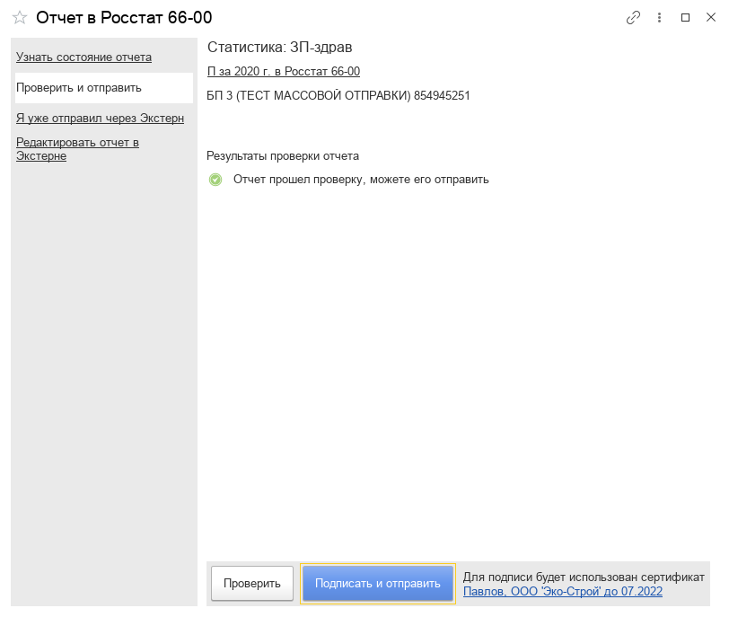
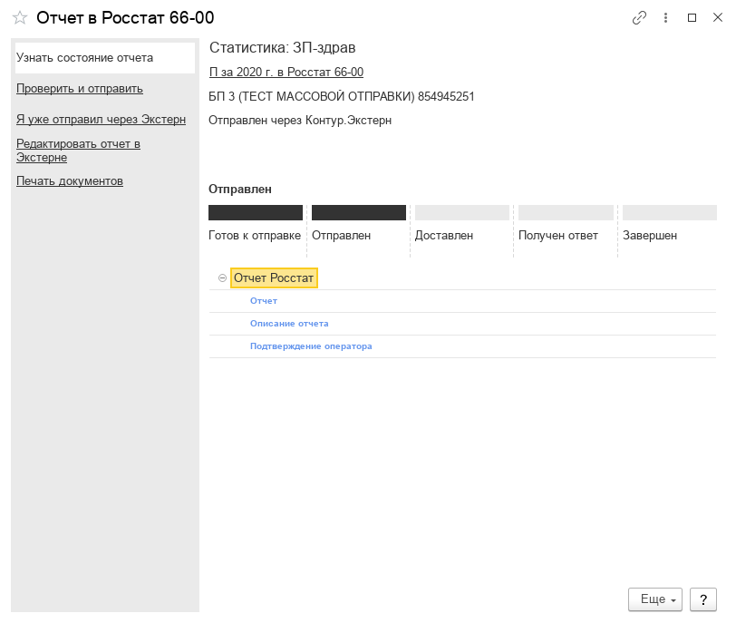

**Функционал:** Отправка в Росстат

**Сценарий:** Росстат

	001. Двойным кликом откроем отчет ЗП-здрав

	002. В форме отчета нажмите "Проверить и отправить"

	003. затем "Проверить"

	004. Ожидайте проверки

	005. Подписать и отправить, после проверки

	006. Ваш отчет был отправлен

