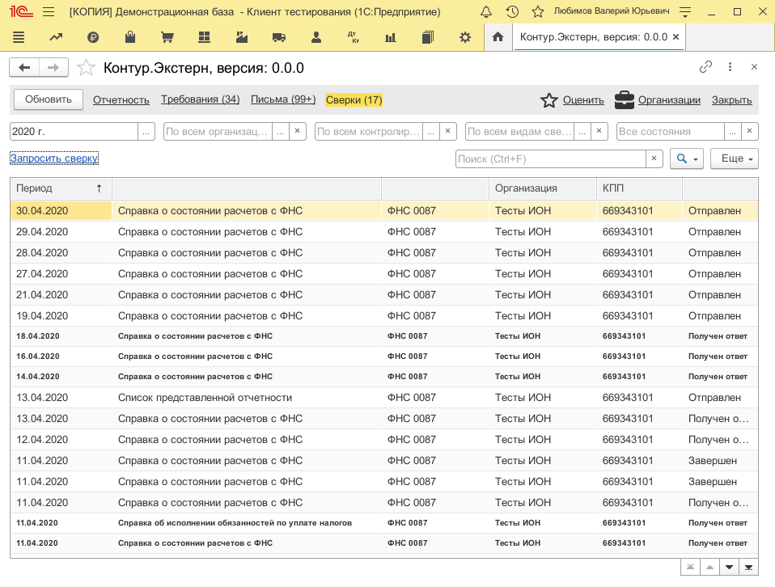
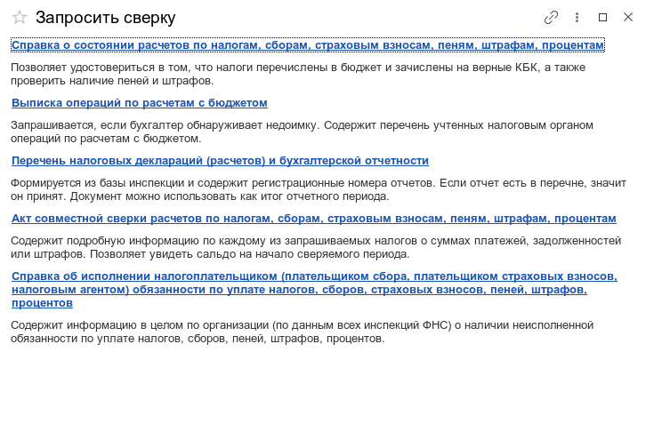
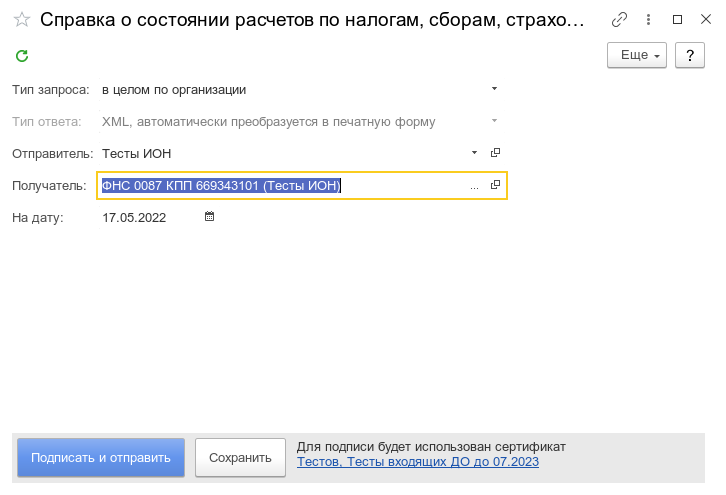
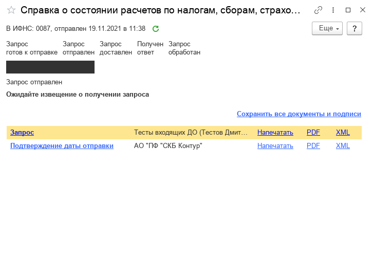
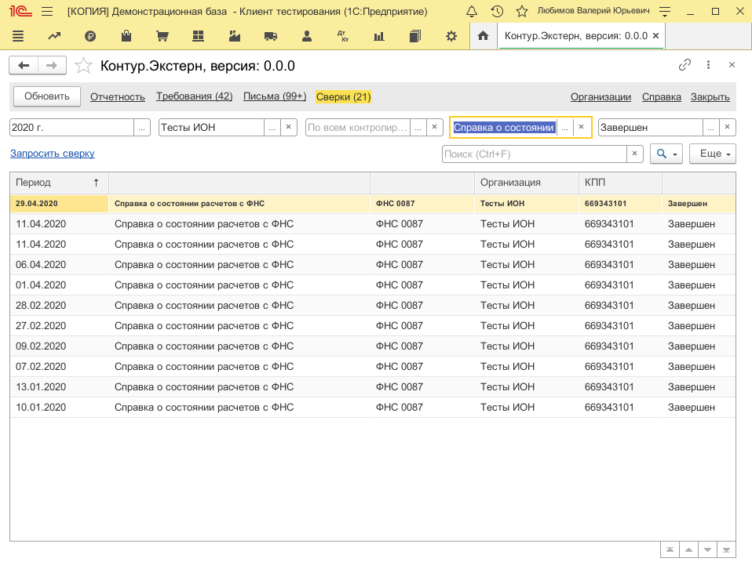
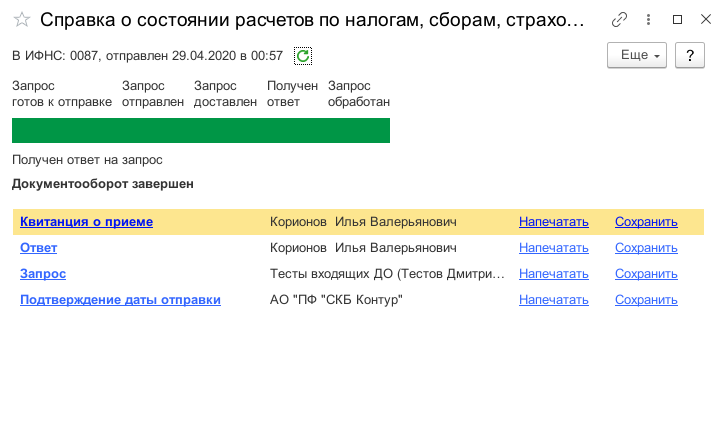

**Функционал:** Сверка с ФНС

**Сценарий:** Справка о состоянии расчетов с ФНС

	001. На странице "Сверки" нажмите на "Запросить сверку"

	002. Выберите вид сверки с ФНС

	003. После выбора организации отправителя и налогового органа получателя, вы можете отправить сверку

	004. Сверка отправлена

**Сценарий:** Сохранить ответ

	001. Найдите сверку на которую ответил налоговый орган

	002. Нажмите "Сохранить" у документа "Ответ"

