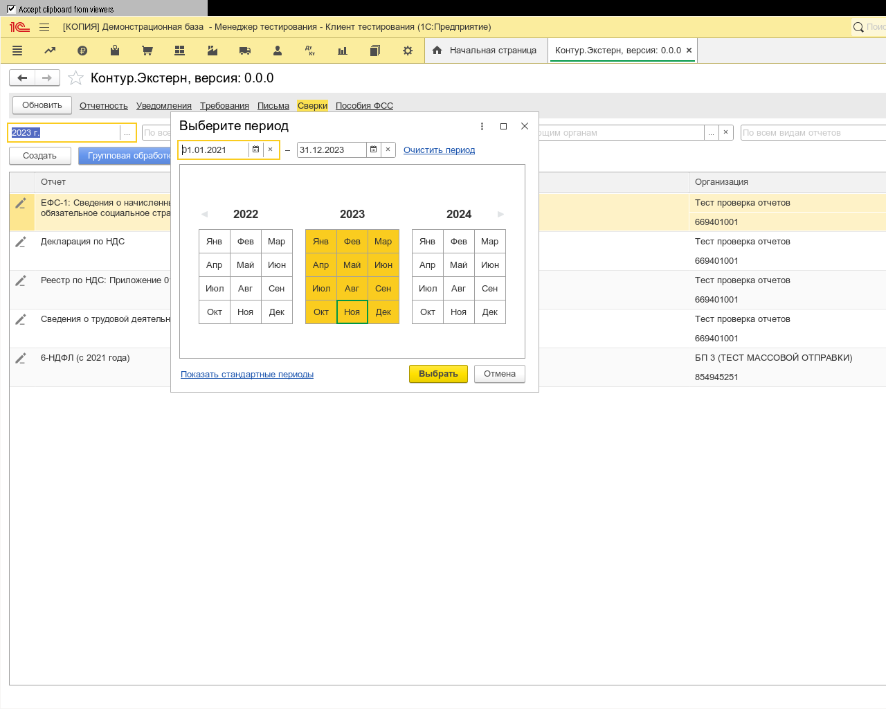
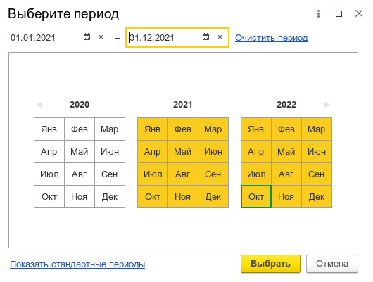
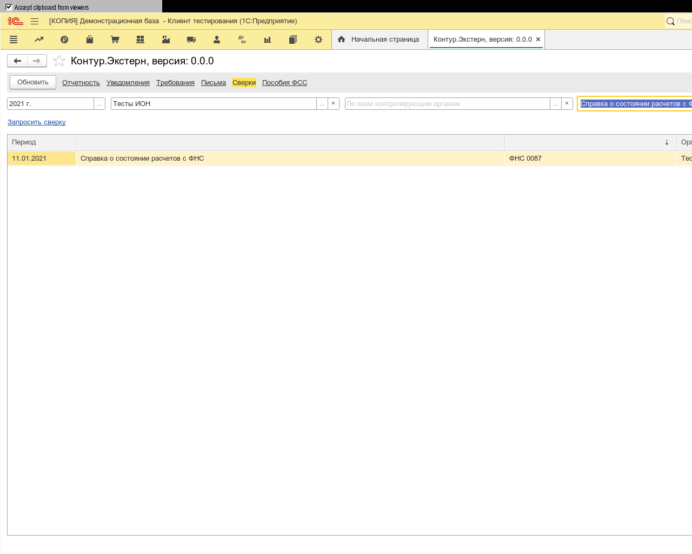
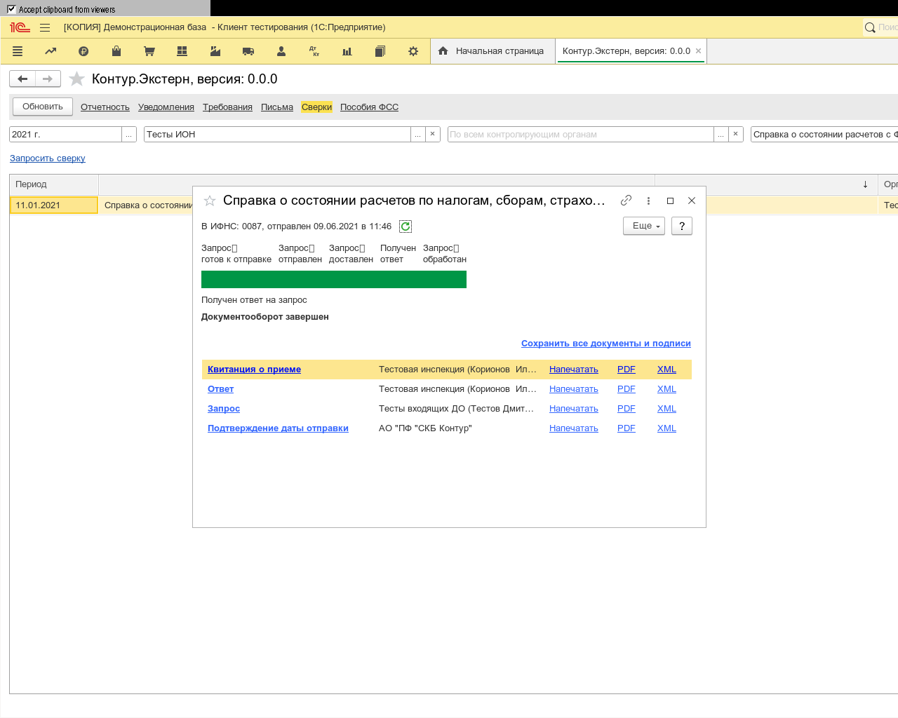

**Функционал:** Сверка с ФНС

**Сценарий:** Справка о состоянии расчетов с ФНС

	001. На странице "Сверки" нажмите на "Запросить сверку"

	002. Выберите вид сверки с ФНС

	003. После выбора организации отправителя и налогового органа получателя, вы можете отправить сверку

	004. Сверка отправлена

**Сценарий:** Сохранить ответ

	001. И я нажимаю кнопку выбора у поля с именем "ПериодПредставление"

	002. И в поле "DateBegin" я ввожу текст "01.01.2021"

	003. И в поле "DateEnd" я ввожу текст "31.12.2021"

	004. И я нажимаю на кнопку "Выбрать"

	005. Найдите сверку на которую ответил налоговый орган

	006. Нажмите "Сохранить" у документа "Ответ"

