001. На странице "Сверки" нажмите на "Запросить сверку"

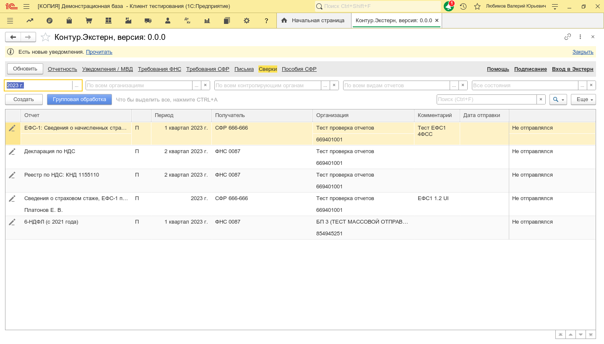

002. Выберите вид сверки с ФНС

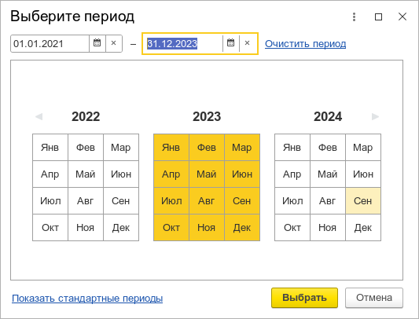

003. Тогда В активном окне открылась форма с заголовком "Вход в систему"

004. И Пауза 1

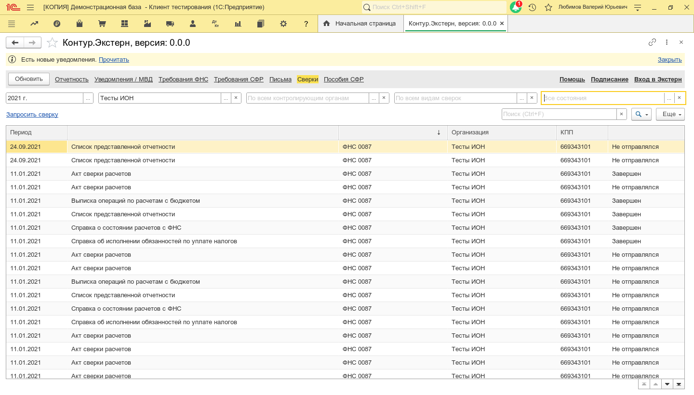

005. И в таблице "СписокСертификатов" я перехожу к строке по шаблону:

006. И в таблице "СписокСертификатов" я выбираю текущую строку

007. После выбора организации отправителя и налогового органа получателя, вы можете отправить сверку

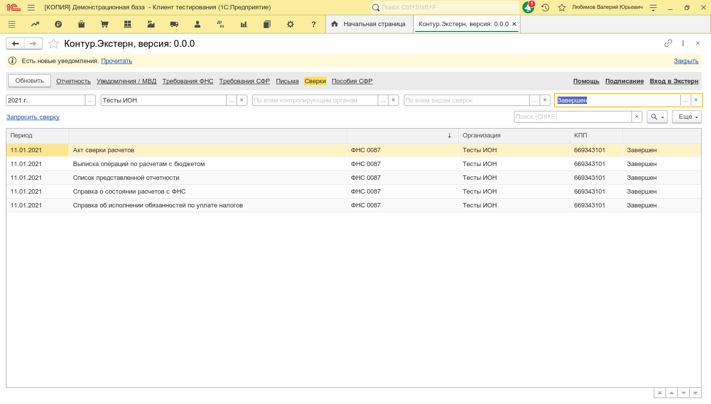

008. И я нажимаю на кнопку 'Подписать и отправить'

009. Тогда В активном окне открылась форма с заголовком "Пожалуйста подождите"

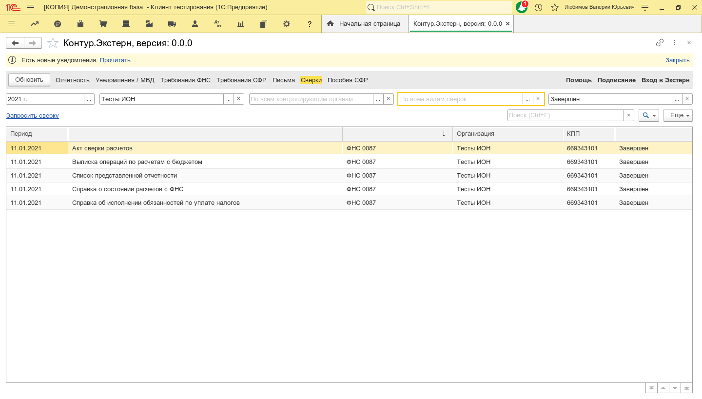

010. И я жду 60 секунд, что в активном окне закрылась форма с заголовком "Пожалуйста подождите"

011. И я жду, что у группы страниц "ЭкраныФормы" текущей страницей станет "Документооборот" в течение 60 секунд

012. И Пауза 5

013. Сверка отправлена

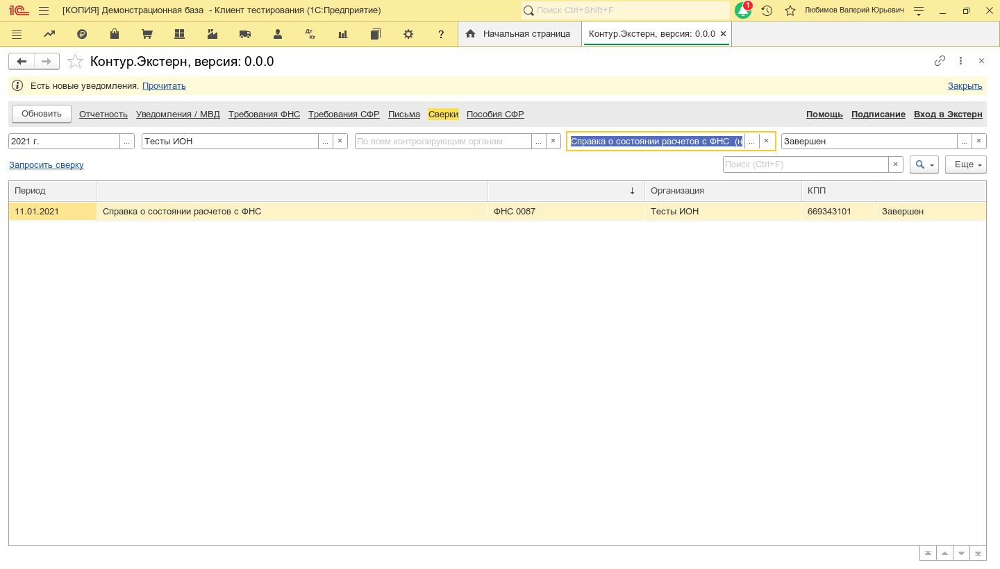

001. И я нажимаю кнопку выбора у поля с именем "ПериодПредставление"

002. И в поле "DateBegin" я ввожу текст "01.01.2021"

003. И в поле "DateEnd" я ввожу текст "31.12.2021"

004. И я нажимаю на кнопку "Выбрать"

005. И я нажимаю кнопку очистить у поля с именем "СписокОрганизаций3"

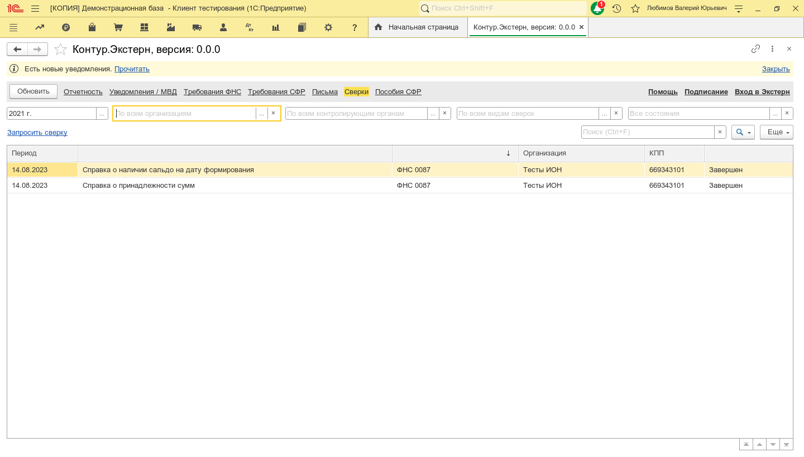

006. И я нажимаю кнопку выбора у поля с именем "СписокОрганизаций3"

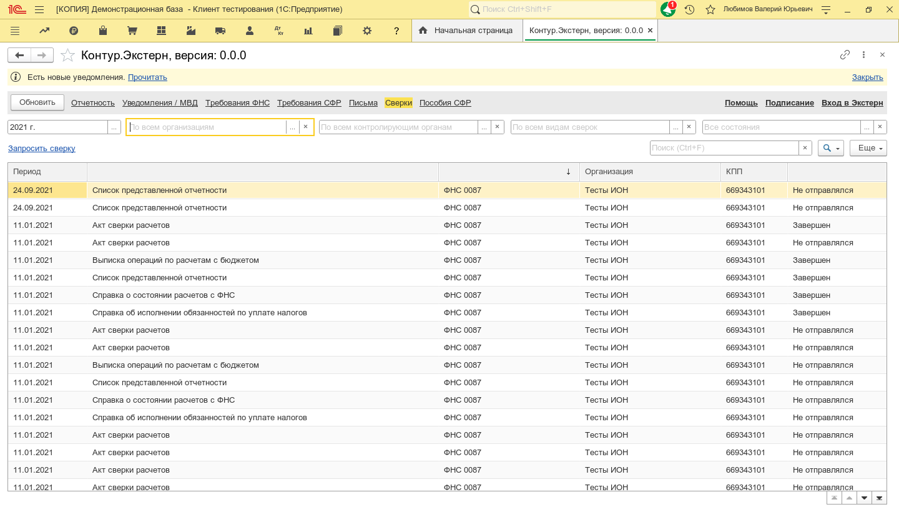

007. И в таблице "СписокЗначений" я перехожу к строке:

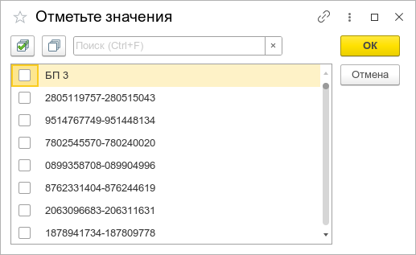

008. И в таблице "СписокЗначений" я устанавливаю флаг "Пометка"

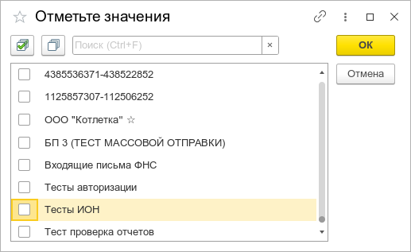

009. И я нажимаю на кнопку "ОК"

010. Тогда элемент формы с именем "СписокОрганизаций3" стал равен 'Тесты ИОН'

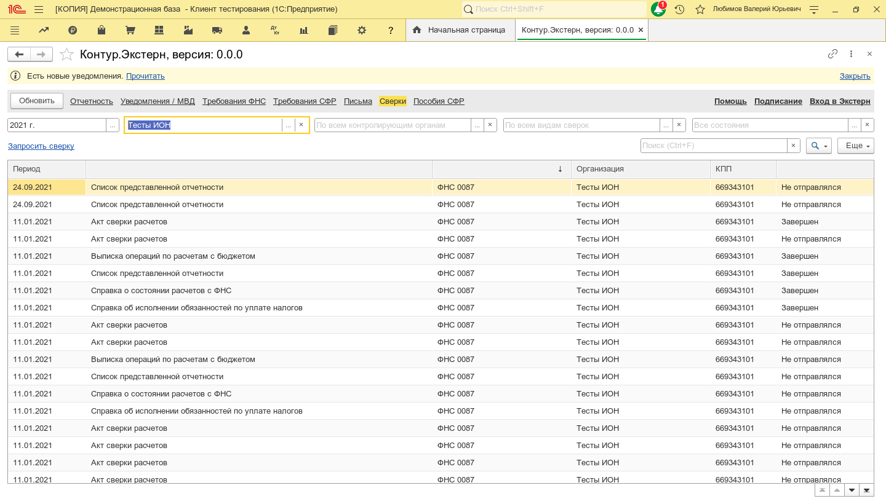

011. И я нажимаю кнопку очистить у поля с именем "СписокСостоянийИОН"

012. И я нажимаю кнопку выбора у поля с именем "СписокСостоянийИОН"

013. И в таблице "СписокЗначений" я перехожу к строке:

014. И в таблице "СписокЗначений" я устанавливаю флаг "Пометка"

015. И я нажимаю на кнопку "ОК"

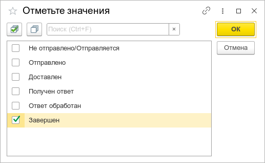

016. И элемент формы с именем "СписокСостоянийИОН" стал равен 'Завершен'

017. И я нажимаю кнопку очистить у поля с именем "СписокТиповИОН"

018. И я нажимаю кнопку выбора у поля с именем "СписокТиповИОН"

019. И в таблице "СписокЗначений" я перехожу к строке:

020. И в таблице "СписокЗначений" я устанавливаю флаг "Пометка"

021. И я нажимаю на кнопку "ОК"

022. И элемент формы с именем "СписокТиповИОН" стал равен 'Справка о состоянии расчетов с ФНС (не применяется с 01.01.2023)'

023. Найдите сверку на которую ответил налоговый орган

024. И в таблице "СписокСверок" количество строк "больше" 0

025. И в таблице "СписокСверок" я перехожу к первой строке

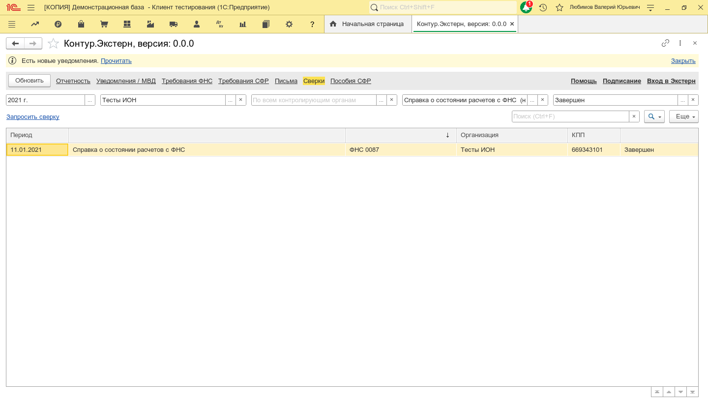

026. И в таблице "СписокСверок" я выбираю текущую строку

027. Тогда В активном окне открылась форма с заголовком "Вход в систему"

028. И Пауза 1

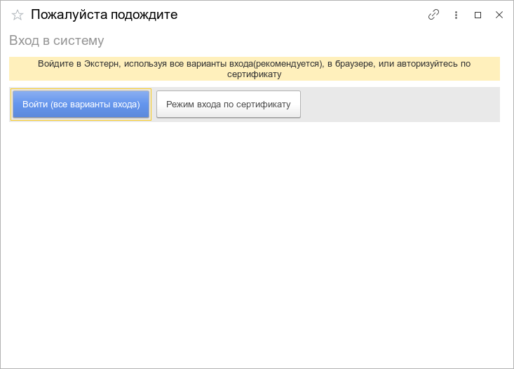

029. И в таблице "СписокСертификатов" я перехожу к строке по шаблону:

030. И в таблице "СписокСертификатов" я выбираю текущую строку

031. Нажмите "Сохранить" у документа "Ответ"

