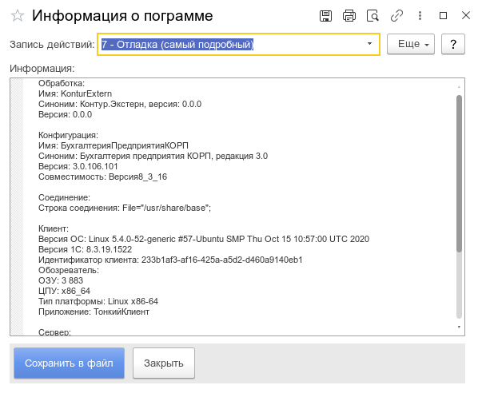

**Функционал:** Сохранить информацию о неисправности

**Сценарий:** Сохранить информацию о неисправности

	001. Нажмите на Еще -> Обслуживание, сохранить в файл для сохранение информации для тех. поддержки

