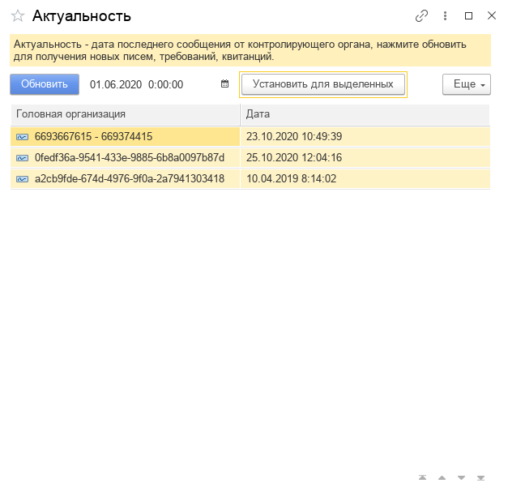

**Функционал:** Установить дату последнего сообщения от контролирующего органа

**Сценарий:** Установить дату последнего сообщения от контролирующего органа

	001. Выберите дату, и организации в списке(можно несколько), и нажмите кнопку "Установить для выделенных"

