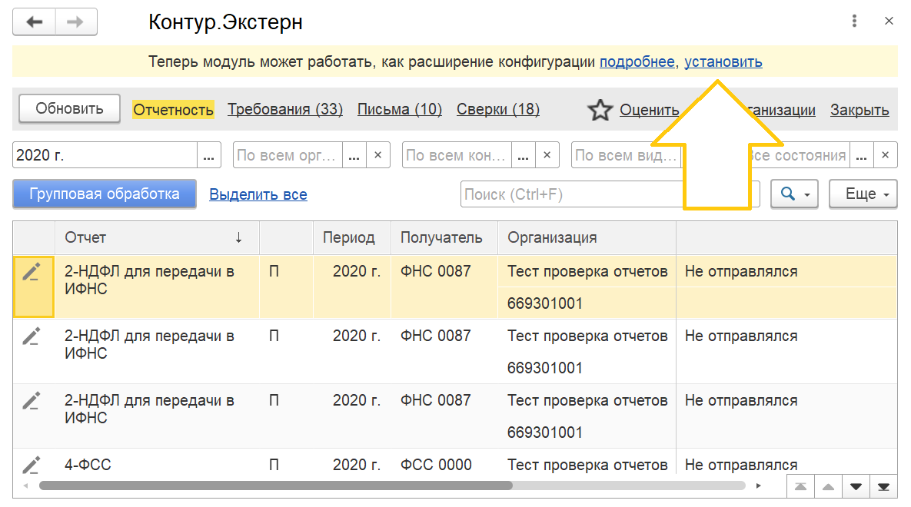
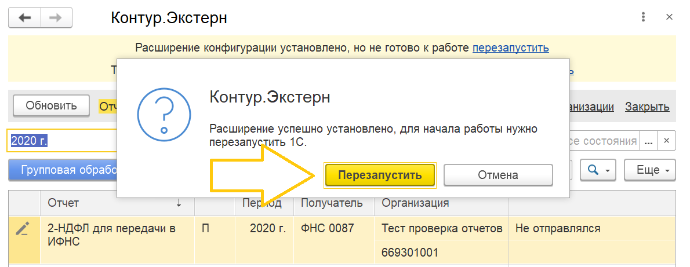
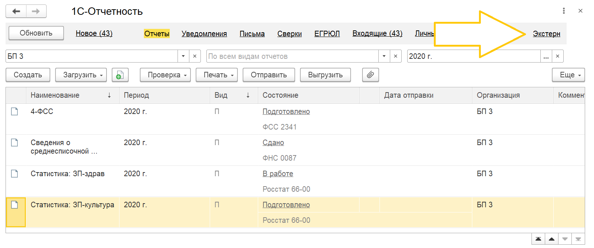
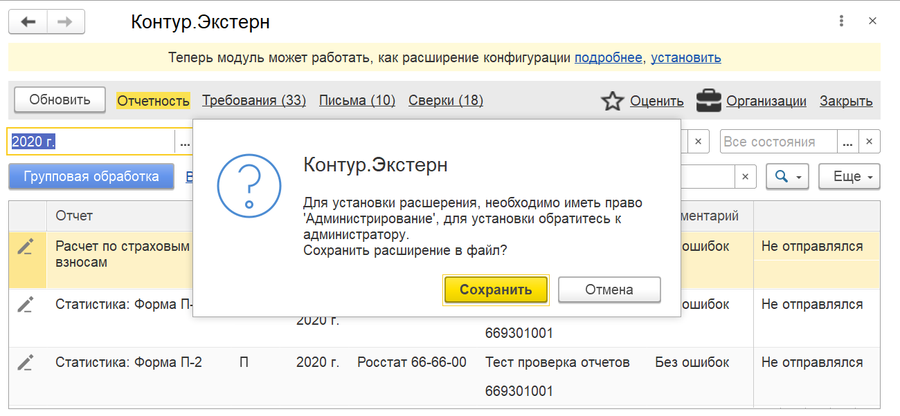

# Переход

Если вы ранее использовали обработку, установить расширение можно из нее.

Нажмите установить и перезапустите программу.

Готово, теперь Экстерн доступен на начальной странице и в списке регламентированных отчетов

## Недостаточно прав

Если у вас недостаточно прав для установки расширения, пожалуйста попросите выполнить действия администратор

