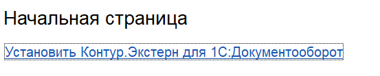
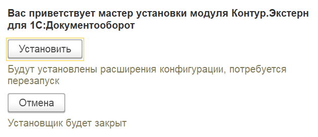
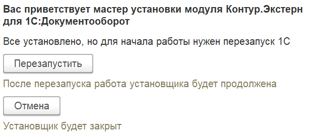
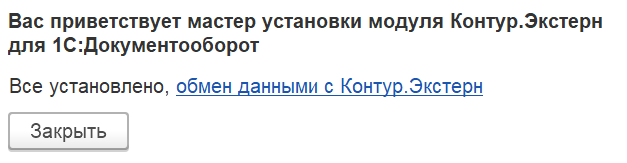

# Установить для 1С:Документооборот

[Скачать](https://update.kontur.ru/1c/v1/kext/extension){ .md-button .md-button--primary }

## Шаг 1

Установите [обработку](install-dp.md) или [расширение](install-ext.md) или откройте [внешнюю обработку](https://update.kontur.ru/1c/v1/kext/data-processor) интерактивно

## Шаг 2

Установите все компоненты модуля для 1С:Документооборот

## Шаг 3

Перезапустите чтобы начать работу

## Шаг 4

Все готово

## Начать пользоваться

[Настроить обмен данными](../users/features-do2/setup.md){ .md-button .md-button--primary }
