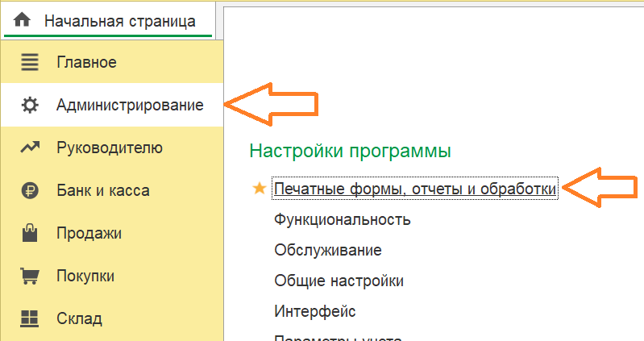
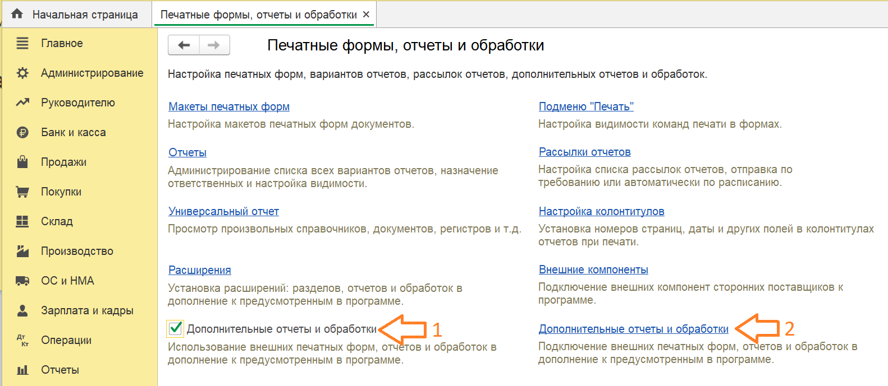
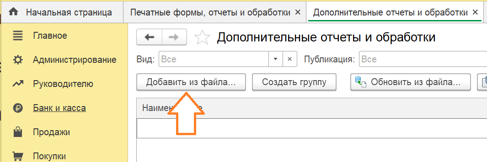
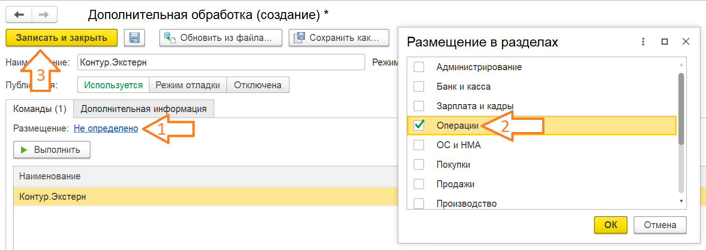
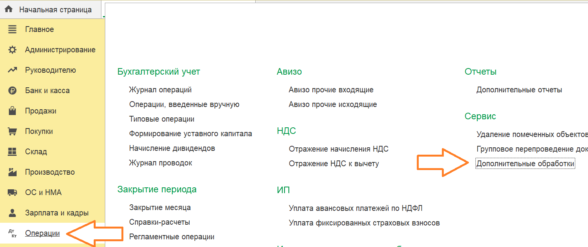
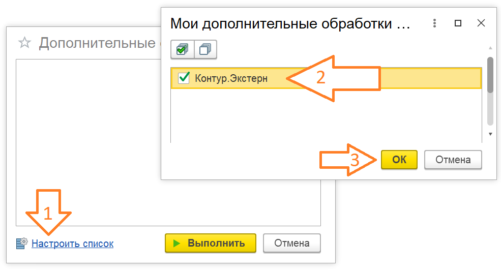
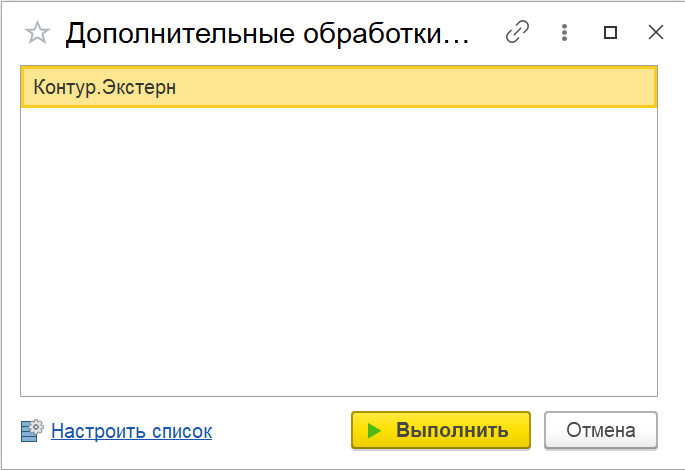

# Установить дополнительную обработку

[Скачать](https://update.kontur.ru/1c/v1/kext/data-processor){ .md-button .md-button--primary }

## Шаг 1

Откройте настройку печатных форм, отчетов и обработок и добавьте новую

1. Включите использование доп. отчетов и обработок
2. Откройте их список

Добавьте новую обработку из файла

## Шаг 2

Настройте размещение и сохраните

1. Нажмите на ссылку "Не определено"
2. Выберите раздел, например "операции", и нажмите "ОК"
3. Сохраните обработку

## Шаг 3

Настройте список доп. обработок раздела, выбранного на предыдущем шаге, например "Операции"

1. Откройте раздел "Операции"
2. Дополнительные обработки

Настройте список

1. Нажмите на ссылку "Настроить список"
2. Отметьте обработку
3. ОК

Обработка установлена

