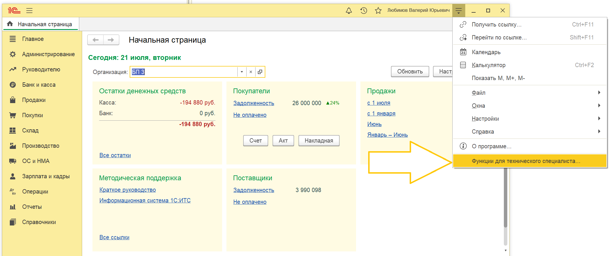
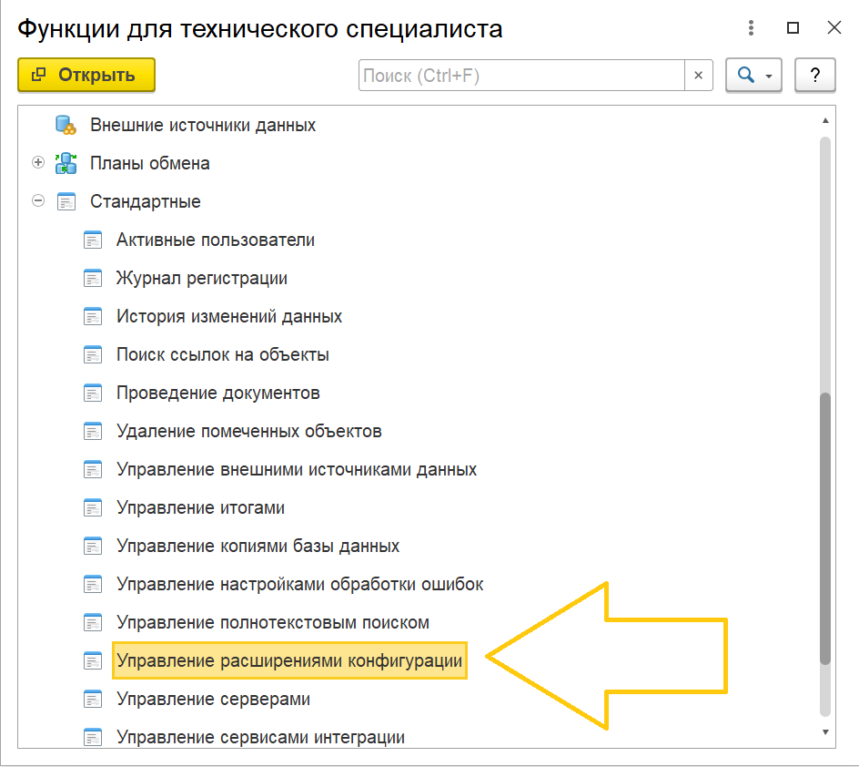
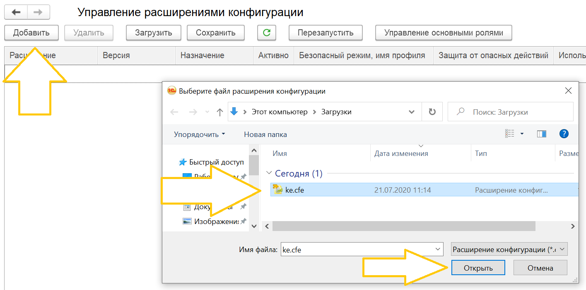
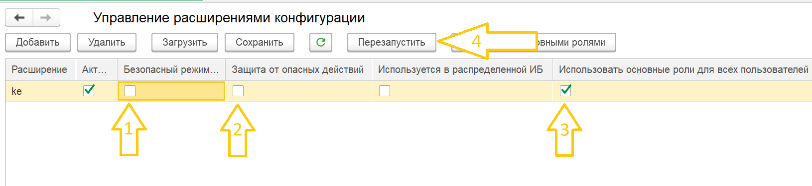
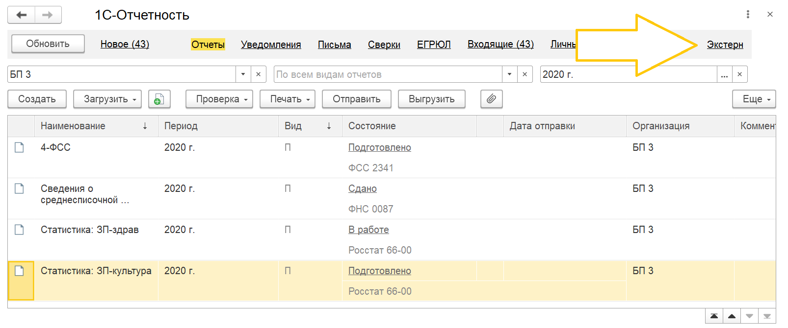

# Установить расширение

[Скачать](https://update.kontur.ru/1c/v1/kext/extension){ .md-button .md-button--primary }

## Шаг 1

Для установки расширения откройте "Управление расширениями конфигурации"

## Шаг 2

Добавьте расширение и файла и настройте его

Настройте расширение и перезапустите программу:

1. Безопасный режим - нет
2. Защита от опасных действий - нет
3. Использовать основные роли - да
4. Перезапустите программу

**Безопасный режим** - запрещает расширению использовать интернет и работать с файлами на сервере

**Защита от опасных действий** - показывает предупреждения, при попытке опасных действий (работой с программами на компьютере)

**Использовать основные роли** - расширение будет доступно всем пользователям

Готово, теперь Экстерн доступен на начальной странице и в списке регламентированных отчетов

