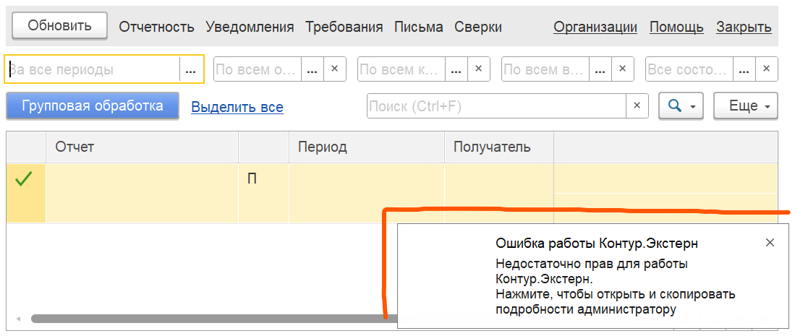

# Права пользователей

## Бухгалтерия предприятия

Профили доступа готовые к работе:

- Главный бухгалтер

## ЗУП

Профили доступа готовые к работе:

- Старший кадровик-расчетчик

## Роли отдельно

Чтобы подготовить к работе с модулем кадровика, расчетчика, бухгалтера нужно:

1. Создать профиль доступа с доп. ролями (для Контур.Экстерн)
2. Создать группу доступа (для Контур.Экстерн)
3. Добавить пользователей в группу

Роли для профиля Контур.Экстерн:

- Добавление и изменение дополнительных реквизитов и сведений
- Право на защищенный документооборот с контролирующими органами

## Диагностика

При открытии модуля выполняется диагностика прав, нажмите на уведомление чтобы открыть подробности

## РЛС

Если вы используете РЛС, настроили роли и проблемы с правами сохраняются - [напишите нам](https://kontur.ru/support#ke-1c), возможно потребуется выполнить нестандартные настройки.
