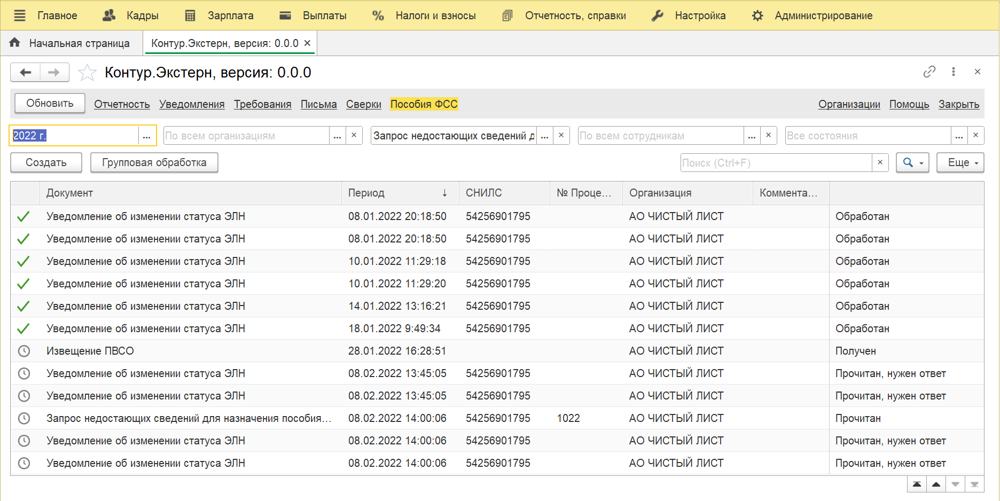
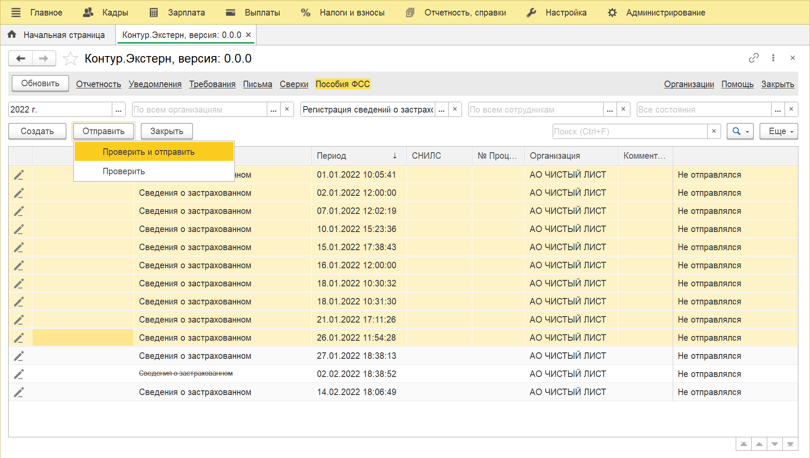
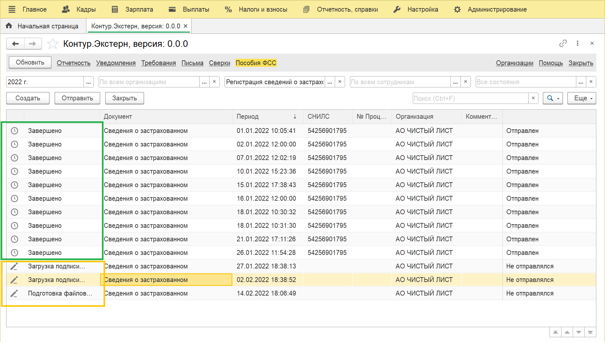

# Пособия ФСС, социальный документооборот

## Извещения, уведомления запросы

На странице пособия вы найдете полученные из ФСС:

- Запросы недостающих сведений для назначения пособия ФСС
- Извещения ПВСО
- Уведомления об изменении статуса ЭЛН
- Информацию о несоответствии сведений о застрахованном лице ФСС

Раздел доступен в конфигурациях, [см. подробнее](https://v8.1c.ru/lawmonitor/2b349ece-f461-11eb-94fd-0050569f3973.htm):

- Бухгалтерия предприятия КОРП, редакция 3.0
- Бухгалтерия предприятия, редакция 3.0
- Зарплата и управление персоналом, редакция 3
- Зарплата и управление персоналом, редакция 3 LTS
- 1С:ERP Управление предприятием 2.4
- 1С:ERP Управление предприятием 2.5
- 1С:ERP. Управление холдингом
- 1С:Управление холдингом 8

## Сведения застрахованного

Вы можете отправить подготовленные сведения о застрахованных лицах

## Сведения ПВСО

Отправка сведений для назначения пособия пока не реализована, в наших плана завершить реализацию отправки сведений ПВСО в начале марта

## Массовая отправка сведений

Чтобы отправить сведения по нескольким сотрудникам, активируйте режим групповой обработки, выделите документы и нажмите проверить и отправить.

Документы постепенно будут отправлены

