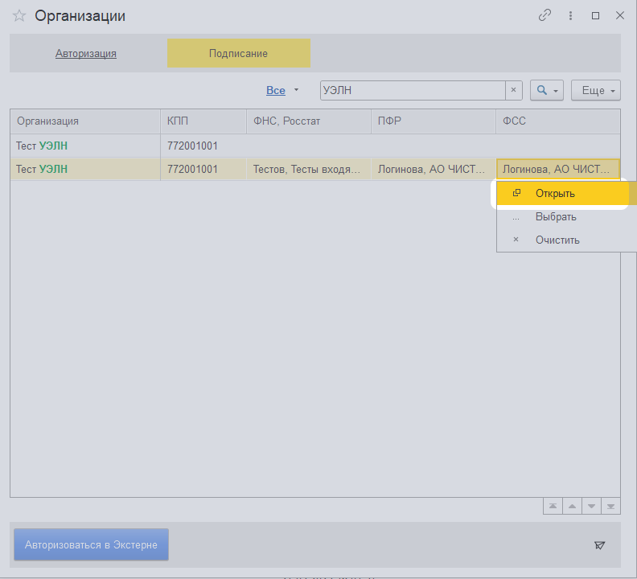
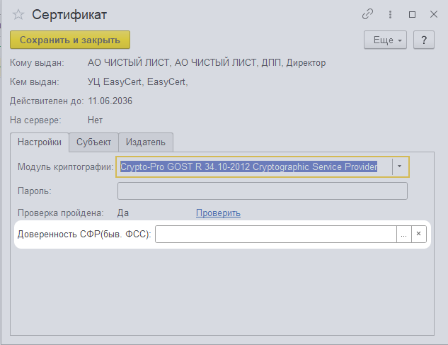
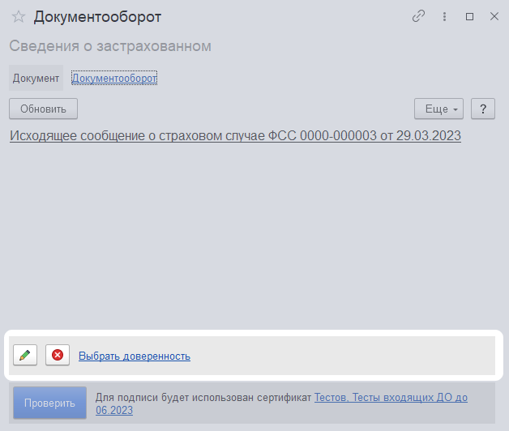

# Пособия ФСС, социальный документооборот

!!! info "Ограничения"

    Раздел доступен если вы используете:

    - [расширение конфигурации](../../start/install-ext.md)
    - [конфигурацию из списка](https://v8.1c.ru/lawmonitor/2b349ece-f461-11eb-94fd-0050569f3973.htm), кроме ЗУП 2.5, УПП 1.3

## Извещения, уведомления, запросы

На странице пособия вы найдете полученные из ФСС:

- Запросы недостающих сведений для назначения пособия ФСС
- Извещения ПВСО
- Уведомления об изменении статуса ЭЛН
- Информацию о несоответствии сведений о застрахованном лице ФСС
- Инициацию выплаты пособия

## Сведения застрахованного

Вы можете отправить подготовленные сведения о застрахованных лицах

## Сведения ПВСО

Вы можете отправить ответы на запросы сведений для назначения пособия

## Массовая отправка сведений

Чтобы отправить сведения по нескольким сотрудникам, активируйте режим групповой обработки, выделите документы и нажмите проверить и отправить.

Документы постепенно будут отправлены

## МЧД

!!! info "Внимание!"

    При отправке документооборота мы пробуем найти МЧД по СНИЛСу или по Сертификату. 
    Настройти МЧД, если хотите чтобы при отправке использовали определенный МЧД
    
Чтобы настроить МЧД для ФСС, необходимо:

- Открыть сертификат подписания ФСС в настройках организации

- Выбрать МЧД в соответствующем поле
  

Если МЧД не настроен, при открытии документооборота мы попытаемся найти его по сертификату подписи. Либо вы можете выбрать его самостоятельно.

 
