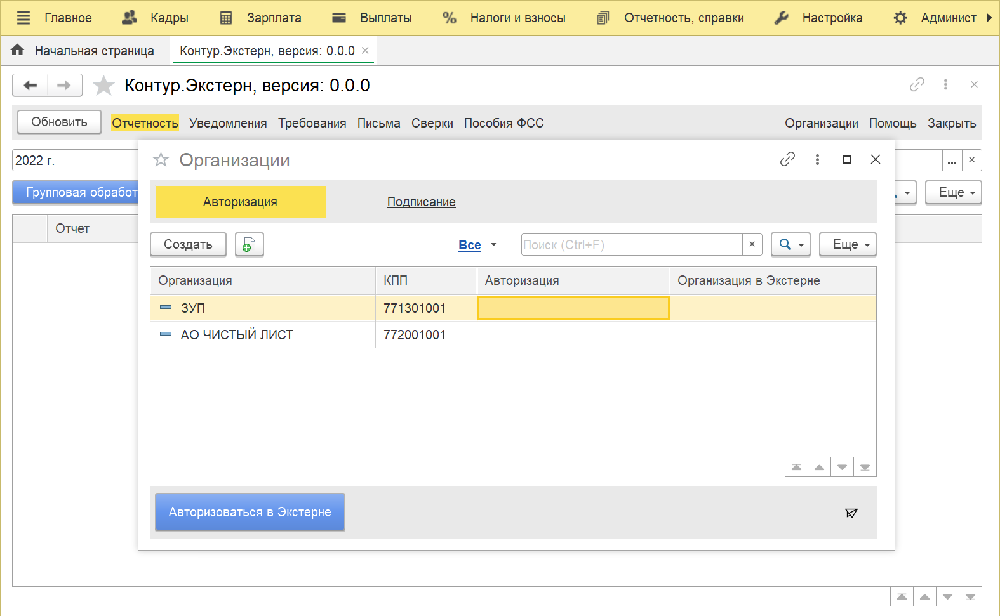
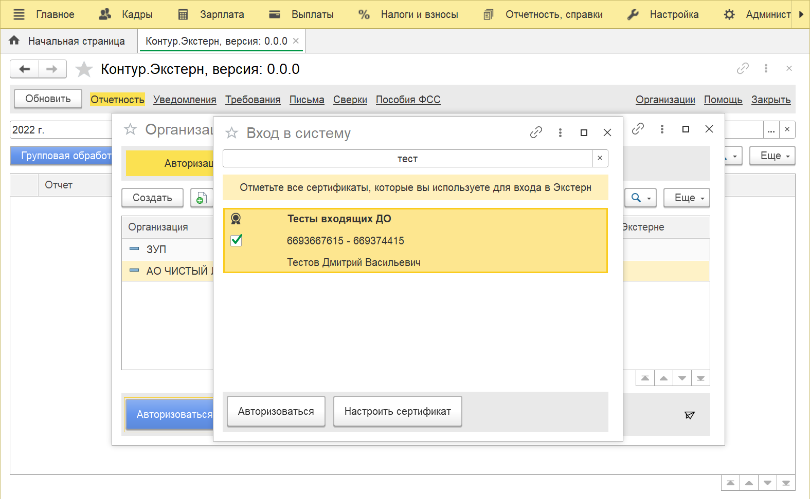
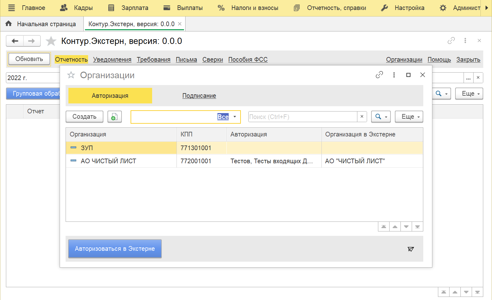
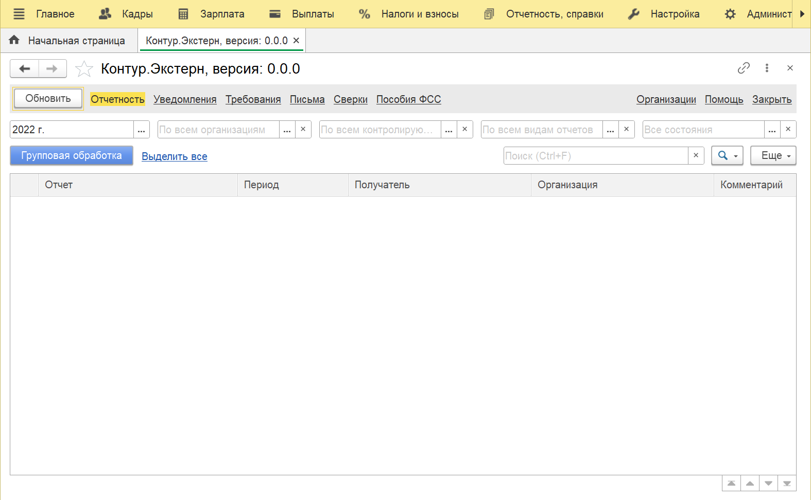

# Настройка

Для настройки обмена выполните действия по шагам

=== "Шаг 1"

    Откройте из модуля список организаций и нажмите "Авторизоваться в Экстерне"

    

=== "Шаг 2"

    Выберите сертификаты для авторизации и нажмите "Авторизоваться"

    

=== "Шаг 3"

    Вы авторизованы

    

=== "Шаг 4"

    Обновите данные, с этого момента начнут загружаться новые документы из контролирующих органов

    
