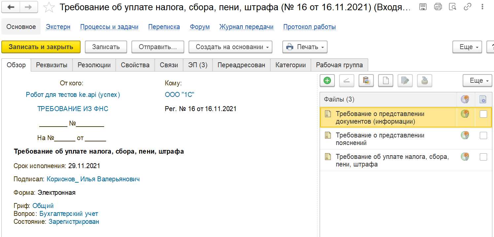

# Входящие документы

## Список

Полученные из контролирующих органов документы будут сохранены в список входящих документов 1С:Документооборот

## Требование

Так выглядит сохраненное требование, расшифруйте документы, чтобы прочитать содержимое

## Расшифровать

Нажмите правой кнопкой на документе и расшифруйте его

все документы расшифрованы

## Отправить квитанцию

Перейдите на закладку "Экстерн" и нажмите "Отправить квитанцию о приеме"

Квитанция отправлена

