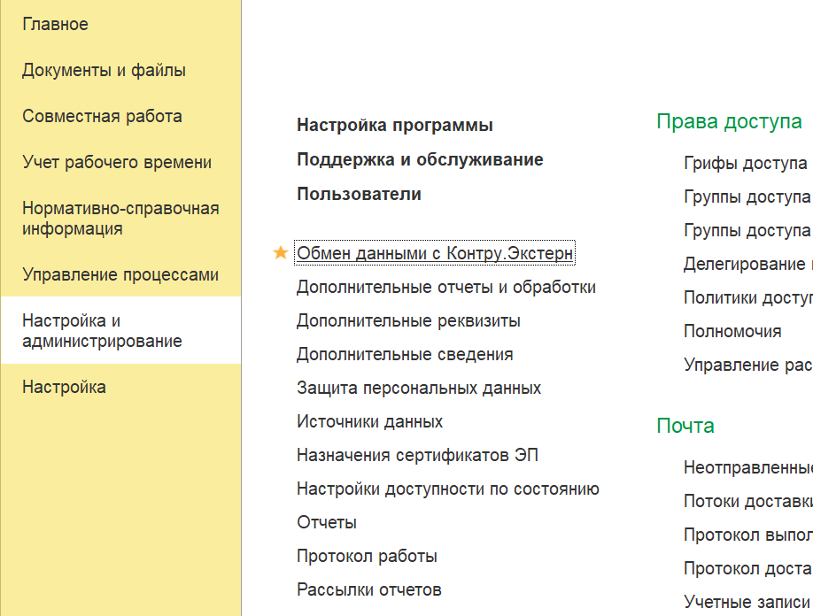
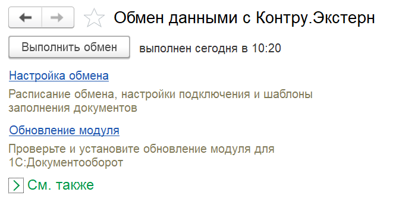
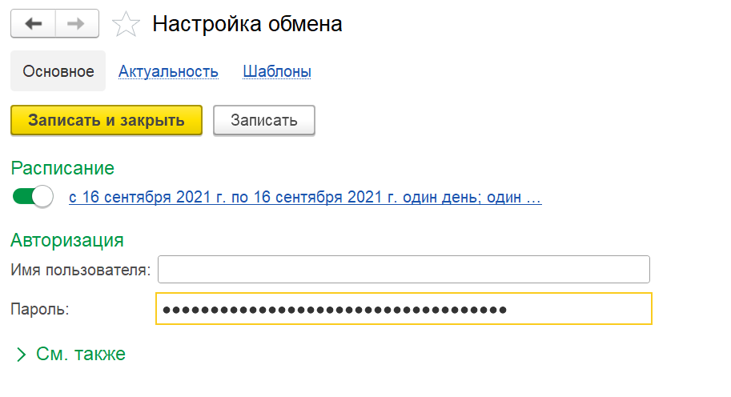
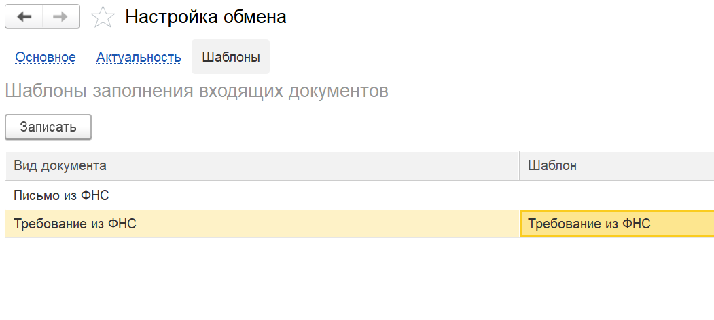

# Настройка

Для настройки обмена выполните действия по шагам

=== "Шаг 1"

    Откройте панель Обмен данными с Контур.Экстерн

    

=== "Шаг 2"

    Откройте настройку обмена

    

=== "Шаг 3"

    Введите имя пользователя и пароль для авторизации в Контур.Экстерн и настройте расписание

    

=== "Шаг 4"

    Укажите шаблоны входящих документов документов, чтобы документы создавались готовыми к регистрации

    
