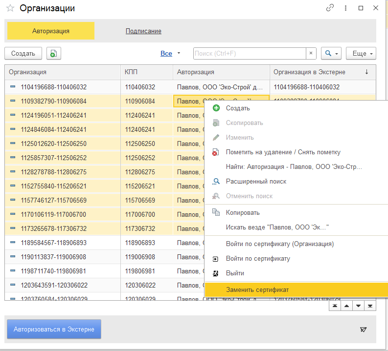
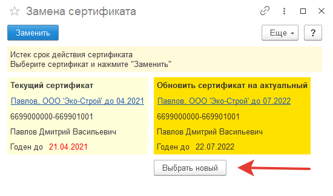
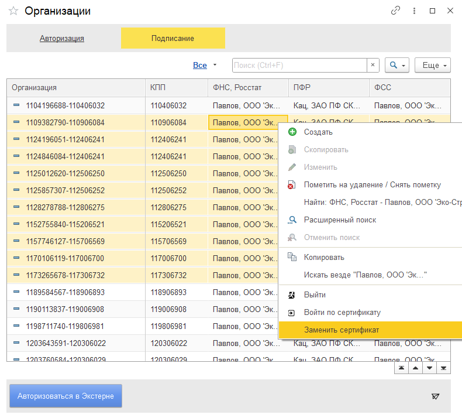
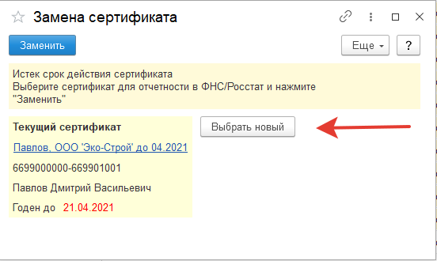

Заменить сертификат можно на форме "Организации"

## Замена сертификата авторизации
Для замены сертификата авторизации проделайте следующие действия:

1. Откройте список сертификатов авторизации  
2. Выделите строки, где нужно поменять сертификат  
3. Нажмите правой кнопкой мыши по колонке "Авторизация" и выберите "Заменить сертификат"  
  
4. Выберите сертификат по кнопке "Выбрать новый" или воспользуйтесь предложенным сертификатом  
  
5. Для сохранения настроек нажмите "Заменить"  

Сертификат будет заменен в настройках авторизации, которые выбрали в списке.  

## Замена сертификата подписания
Для замены сертификатов подписания проделайте следующие действия:

1. Откройте список сертификатов подписания
2. Выделите строки, где нужно поменять сертификат
3. Нажать правой кнопкой мыши по колонке "ФНС, Росстат" и выбрать "Заменить сертификат". Аналогично заменить сертификат для колонок "ПФР" и "ФСС".   
!!! info "Предупреждение"
    Замена сертификата для каждого налогового органа происходит отдельно. При замене сертификата для ФСС, сертификат также не меняется для ФНС, Росстат и ПФР
  
4. Выберите сертификат по кнопке "Выбрать новый" или воспользуйтесь предложенным сертификатом  
    
5. Для сохранения настроек нажмите "Заменить"

Сертификат будет заменен в настройках подписи, которые выбрали в списке.