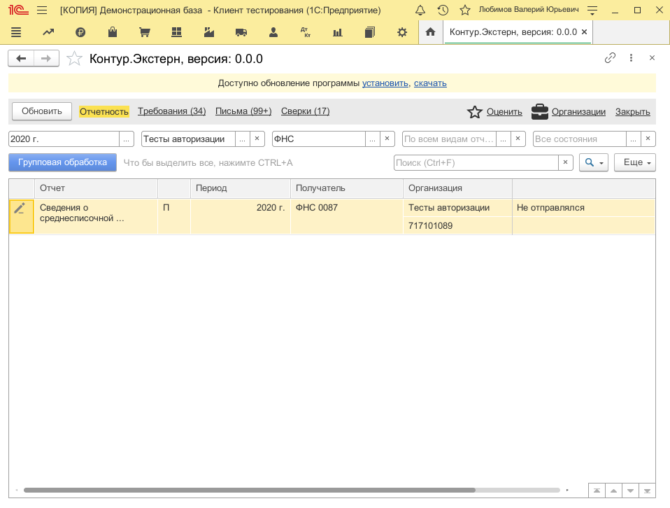
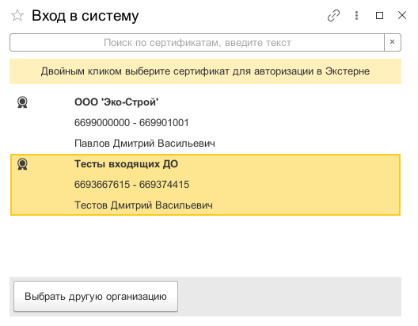
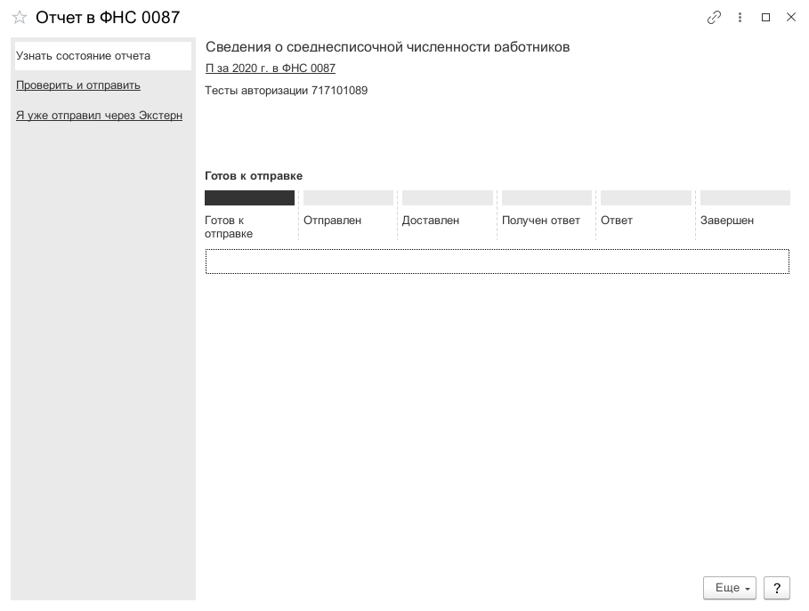

**Функционал:** Авторизация

**Сценарий:** Авторизация

	001. При отправке отчета

	002. Если вы ранее не авторизовались в сервисе, при попытке отправить отчет произойдет запрос авторизации, где сначала нужно сертификат авторизации

	003. Вы авторизованы и готовы отправлять отчет

